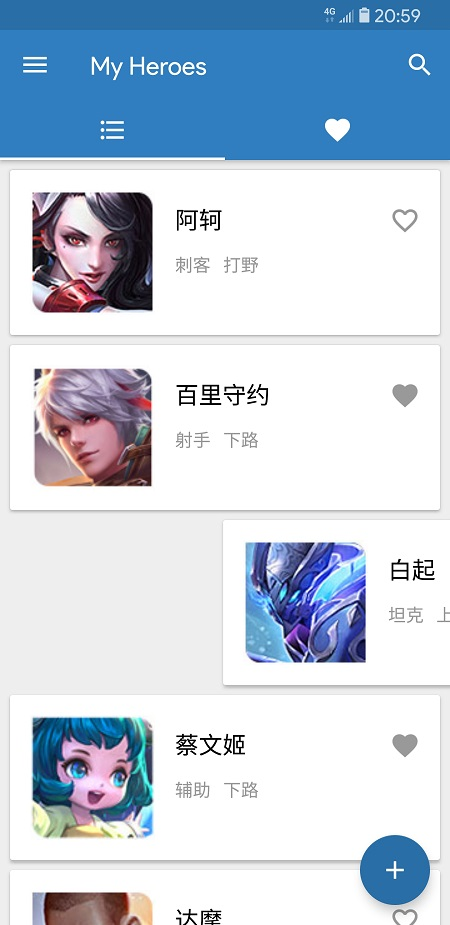
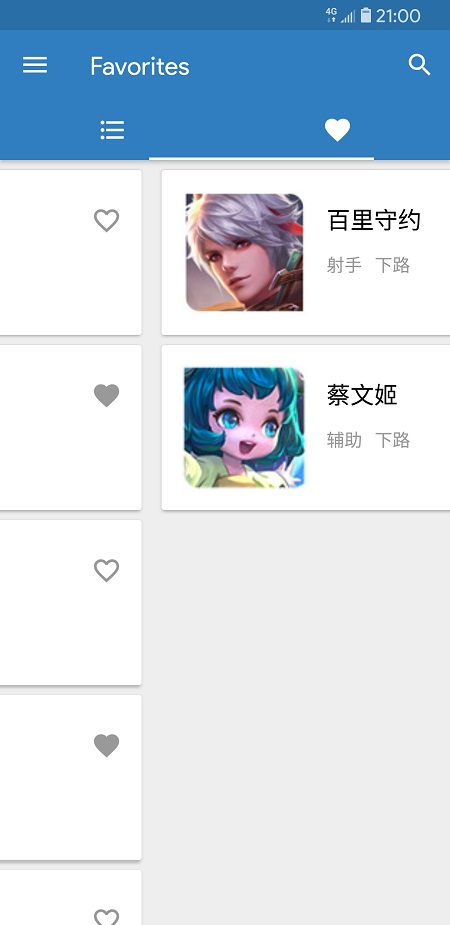
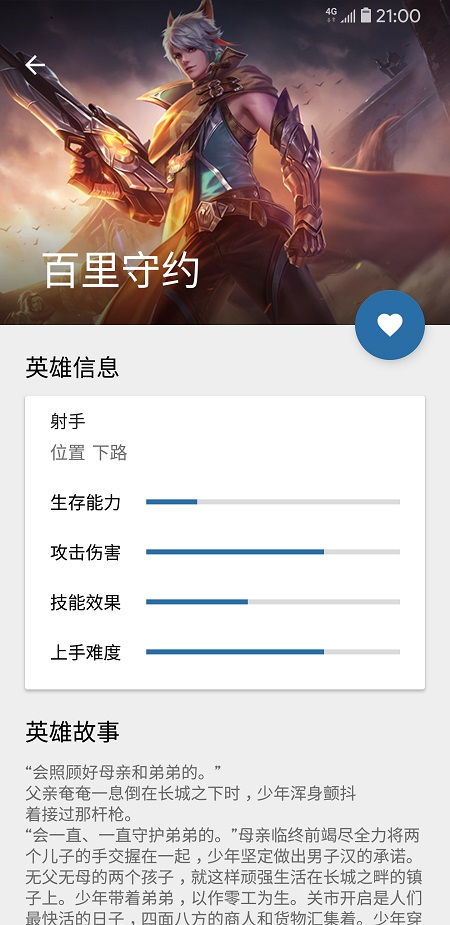
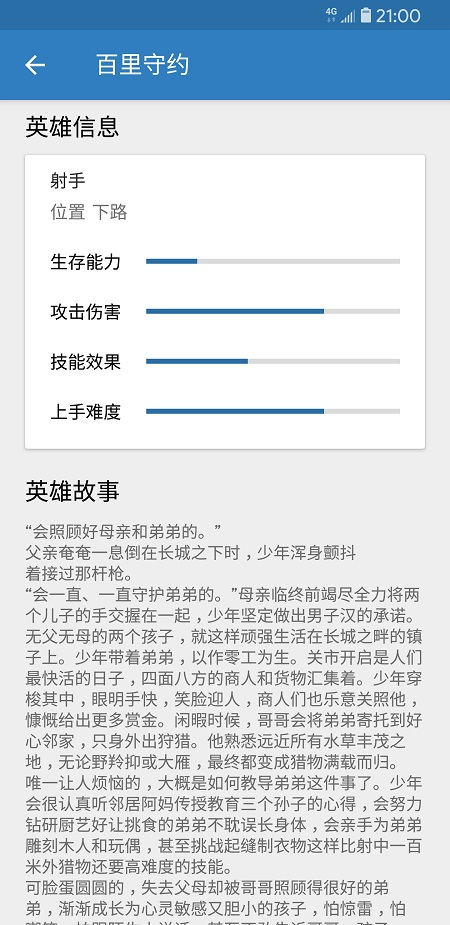
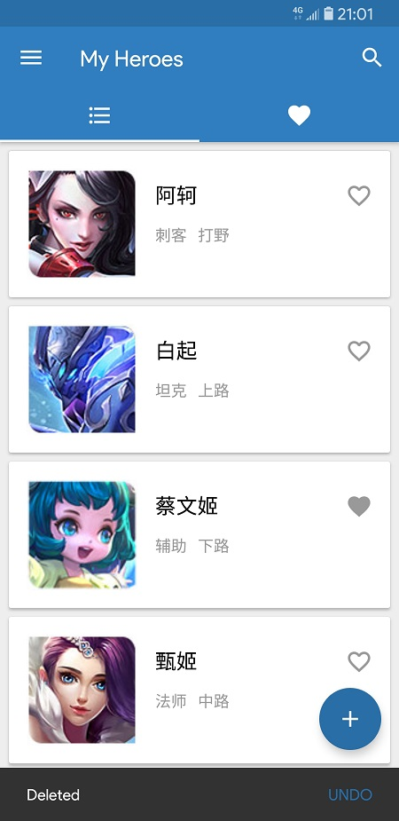
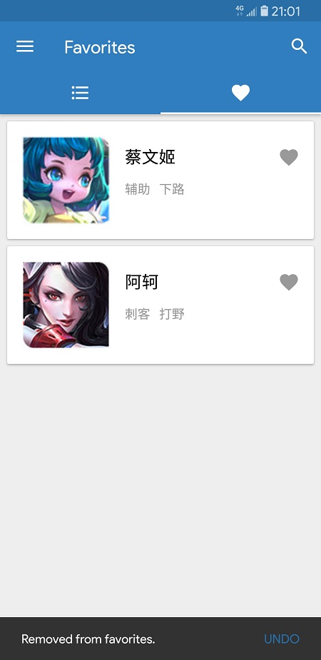
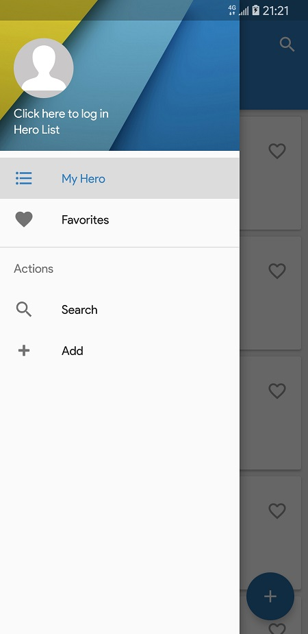
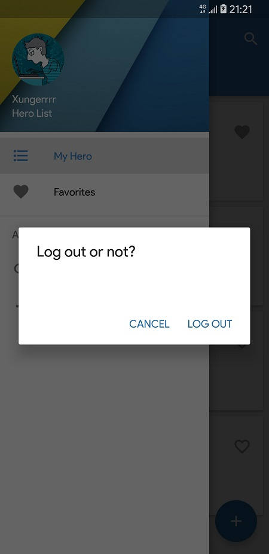
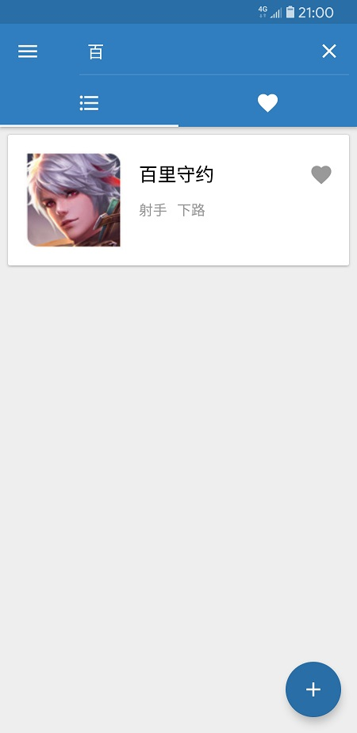
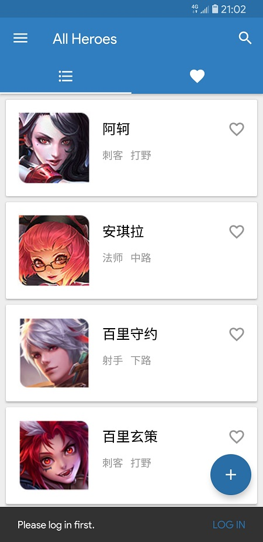

## 一、实验题目
期中项目-王者荣耀英雄大全

---

## 二、实现内容
### 王者荣耀英雄大全

### 项目内容
一个包括王者荣耀英雄人物头像、称号、名字、位置、生存能力值、攻击伤害值、技能效果值、上手难度值和英雄故事等信息的APP


### 项目要求
* 王者荣耀英雄人物的增删改查功能。属性包含头像、称号、名字、位置、生存能力值、攻击伤害值、技能效果值、上手难度值等，其中头像是图片
* App启动时初始化包含10个英雄信息（不要求数据库，可以代码定义或xml）

---

## 三、实验结果

### (1)实验截图

* 登录后，可以在主页滑动删除添加的英雄：

  

* 我的英雄和喜爱的英雄两个页面，可以点击标签切换。收藏状态显示在每一个卡片上。

  

* 英雄详情界面的设计，显示了英雄的全部属性，登录后可以进行收藏操作。

  

  向下滑动，英雄图片会自动收起。

  

* 英雄的删除和取消收藏都可以在短时间内通过下方的SneakBar撤销。

  

  

* 侧边栏可以实现标签切换，也可以跳转到搜索界面或添加英雄的界面。点击Header可以实现登入或登出。

  

  

* 可以在主页快速搜索英雄

  

* 未登录时尝试收藏或添加英雄，会弹出提示

  


### (2)实验步骤以及关键代码


* 英雄详情界面的UI。顶部由AppBarLayout和CollapsingToolbarLayout组成，显示了英雄图片和名称，滚动时可以自动收起。底部由一个NestedScrollView组成，包含了英雄的信息卡片和英雄故事。FloatingActionButton用于收藏英雄，滚动时也能自动隐藏。关键布局代码如下：

  ```xml
  <?xml version="1.0" encoding="utf-8"?>
  <android.support.design.widget.CoordinatorLayout xmlns:android="http://schemas.android.com/apk/res/android"
      xmlns:app="http://schemas.android.com/apk/res-auto"
      xmlns:tools="http://schemas.android.com/tools"
      android:layout_width="match_parent"
      android:layout_height="match_parent"
      android:fitsSystemWindows="true"
      tools:context=".DetailActivity"
      android:background="@color/activity_background">

      <android.support.design.widget.AppBarLayout
          android:id="@+id/app_bar_scrolling"
          android:layout_width="match_parent"
          android:layout_height="260dp"
          android:fitsSystemWindows="true"
          android:theme="@style/AppTheme.AppBarOverlay">

          <android.support.design.widget.CollapsingToolbarLayout
              android:id="@+id/collapsing_toolbar_layout"
              android:layout_width="match_parent"
              android:layout_height="match_parent"
              android:fitsSystemWindows="true"
              app:contentScrim="?attr/colorPrimary"
              app:layout_scrollFlags="scroll|exitUntilCollapsed">

              <ImageView
                  android:id="@+id/hero_img"
                  android:layout_width="match_parent"
                  android:layout_height="match_parent"
                  android:fitsSystemWindows="true"
                  android:scaleType="centerCrop"
                  app:layout_collapseMode="parallax"
                  android:src="@drawable/ak"/>
              <View
                  android:layout_width="match_parent"
                  android:layout_height="80dp"
                  android:fitsSystemWindows="true"
                  android:background="@drawable/scrim_top"
                  app:layout_collapseMode="pin"/>
              <View
                  android:layout_width="match_parent"
                  android:layout_height="100dp"
                  android:layout_gravity="bottom"
                  android:background="@drawable/scrim_bottom"/>
              <android.support.v7.widget.Toolbar
                  android:id="@+id/toolbar"
                  android:layout_width="match_parent"
                  android:layout_height="?attr/actionBarSize"
                  app:layout_collapseMode="pin"
                  app:popupTheme="@style/AppTheme.PopupOverlay" />

          </android.support.design.widget.CollapsingToolbarLayout>
      </android.support.design.widget.AppBarLayout>

      <android.support.design.widget.FloatingActionButton
          android:id="@+id/favorite"
          android:layout_width="wrap_content"
          android:layout_height="wrap_content"
          android:layout_margin="20dp"
          android:src="@drawable/ic_favorite_border_white_24dp"
          app:layout_anchor="@id/app_bar_scrolling"
          app:layout_anchorGravity="bottom|end" />

      <android.support.v4.widget.NestedScrollView
          android:layout_width="match_parent"
          android:layout_height="wrap_content"
          app:layout_behavior="@string/appbar_scrolling_view_behavior">

          <android.support.constraint.ConstraintLayout
              android:id="@+id/bottomPanel"
              android:layout_width="match_parent"
              android:layout_height="wrap_content"
              android:orientation="vertical">

              ...
                      
          </android.support.constraint.ConstraintLayout>
      </android.support.v4.widget.NestedScrollView>

  </android.support.design.widget.CoordinatorLayout>
  ```

* 英雄信息和控件的绑定：

  ```java
  final Hero hero = (Hero) getIntent().getExtras().get("click");
  final String name = (String) getIntent().getExtras().get("name");

  // 设置英雄属性
  type.setText(hero.getType());
  location.setText(hero.getLocation());
  ApplicationInfo appInfo = getApplicationInfo();
  int resID = getResources().getIdentifier(hero.getImage(), "drawable", appInfo.packageName);
  image.setImageResource(resID);
  survivability.setProgress(hero.getViability());
  attackDamage.setProgress(hero.getAttack());
  skillEffect.setProgress(hero.getSkill());
  difficulty.setProgress(hero.getDifficulty());
  story.setText(hero.getStory());

  Toolbar toolbar = (Toolbar) findViewById(R.id.toolbar);
  setSupportActionBar(toolbar);
  if (getSupportActionBar() != null) {
      getSupportActionBar().setDisplayHomeAsUpEnabled(true);
      getSupportActionBar().setDisplayShowHomeEnabled(true);
      // 设置英雄名称
      getSupportActionBar().setTitle(hero.getName());
  }
  ```

* 收藏功能的实现：

  ```java

  if (TextUtils.isEmpty(name)) {
      // 未登录则不允许收藏
      favorite.hide();
  }
  else {
      favorite.show();
      if (myData.isLike(name, hero.getName())) {
          favorite.setImageResource(R.drawable.ic_favorite_white_24dp);
      }
      else {
          favorite.setImageResource(R.drawable.ic_favorite_border_white_24dp);
      }
      favorite.setOnClickListener(new View.OnClickListener() {
          @Override
          public void onClick(View v) {
              // 调用数据库接口实现收藏
              if (myData.isLike(name, hero.getName())) {
                  myData.unlikeHero(name, hero.getName());
                  favorite.setImageResource(R.drawable.ic_favorite_border_white_24dp);
              }
              else {
                  myData.likeHero(name, hero.getName());
                  favorite.setImageResource(R.drawable.ic_favorite_white_24dp);
              }
              // 通过isLikedChanged判断是否改变收藏状态
              isLikedChanged = !isLikedChanged;
          }
      });
  }
  ```

* 删除功能的实现

  在英雄列表的fragment里，创建ItemTouchHelper对象，重载onSwiped方法。当滑动卡片时，调用英雄列表的RecyclerViewAdapter.onItemDelete删除英雄。

  ```java
  mItemTouchHelper = new ItemTouchHelper(new ItemTouchHelper.Callback() {
      
      ...

      @Override
      public void onSwiped(@NonNull RecyclerView.ViewHolder viewHolder, int i) {
          ((MyRecyclerViewAdapter) mRecyclerViewAdapter).onItemDelete(viewHolder.getAdapterPosition());
          ((MainActivity)getActivity()).favoritesFragment.refresh(name);
          ((MainActivity)getActivity()).favoritesFragment.mRecyclerViewAdapter.notifyDataSetChanged();
      }
  });
  ```

  Adapter里的删除函数：

  ```java
  public void onItemDelete(final int position) {
      final Hero deleted = data.get(position);
      data.remove(position);
      allData.remove(position);
      if (!TextUtils.isEmpty(name)) {
          myData.unAddHero(name, deleted.getName());
      }
      notifyItemRemoved(position);

      Snackbar.make(parentView, "Deleted", Snackbar.LENGTH_SHORT)
              .setAction("Undo", new View.OnClickListener() {
                  @Override
                  public void onClick(View v) {
                      data.add(position, deleted);
                      allData.add(position, deleted);
                      if (!TextUtils.isEmpty(name)) {
                          myData.addHero(name, deleted.getName());
                      }
                      notifyItemInserted(position);
                  }
              }).show();
  }
  ```

* 主页标签分页的实现。

  在布局文件中，通过TabLayout和ViewPager的组合，实现标签分页。通过向ViewPager里加入HeroListFragment和FavoritesFragment，实现两个列表的显示。

  主页布局：

  ```xml
  <android.support.design.widget.AppBarLayout
      android:layout_width="match_parent"
      android:layout_height="wrap_content"
      android:theme="@style/AppTheme.AppBarOverlay">

      <android.support.v7.widget.Toolbar
          android:id="@+id/toolbar"
          android:layout_width="match_parent"
          android:layout_height="?attr/actionBarSize"
          android:background="?attr/colorPrimary"
          app:layout_scrollFlags="scroll|enterAlways"
          app:popupTheme="@style/AppTheme.PopupOverlay" />
      <android.support.design.widget.TabLayout
          android:id="@+id/tab_layout"
          android:layout_width="match_parent"
          android:layout_height="wrap_content"
          app:tabIndicatorColor="@color/white" />

  </android.support.design.widget.AppBarLayout>

  <android.support.v4.view.ViewPager
      android:id="@+id/view_pager"
      android:layout_width="match_parent"
      android:layout_height="match_parent"
      app:layout_behavior="@string/appbar_scrolling_view_behavior" />
  ```

  TabLayout和ViewPager的绑定，以及fragment的加入：

  ```java
  mTabLayout = findViewById(R.id.tab_layout);
  mViewPager = findViewById(R.id.view_pager);
  List<String> titles = new ArrayList<>();
  titles.add("Hero List");
  titles.add("Favorites");

  List<Fragment> fragments = new ArrayList<>();
  heroListFragment = new HeroListFragment();
  favoritesFragment = new FavoritesFragment();
  fragments.add(heroListFragment);
  fragments.add(favoritesFragment);
  mViewPager.setOffscreenPageLimit(2);

  MyFragmentAdapter mFragmentAdapter = new MyFragmentAdapter(getSupportFragmentManager(), fragments);
  mViewPager.setAdapter(mFragmentAdapter);
  mTabLayout.setupWithViewPager(mViewPager);
  mTabLayout.getTabAt(0).setIcon(R.drawable.ic_format_list_bulleted_white_24dp);
  mTabLayout.getTabAt(1).setIcon(R.drawable.ic_favorite_white_24dp);
  mViewPager.addOnPageChangeListener(new ViewPager.OnPageChangeListener() {
      @Override
      public void onPageScrolled(int i, float v, int i1) {}

      @Override
      public void onPageSelected(int i) {
          if (i == 0) {
              fab.show();
              if (!searchView.isIconified()) {
                  searchView.setIconified(true);
                  ((MyRecyclerViewAdapter)favoritesFragment.mRecyclerViewAdapter).setFilterText("");
              }
              if(login) {
                  getSupportActionBar().setTitle("My Heroes");
                  heroListFragment.mItemTouchHelper.attachToRecyclerView(heroListFragment.mRecyclerView);
              }
              else {
                  getSupportActionBar().setTitle("All Heroes");
              }
              MenuItem item = navigationView.getMenu().findItem(R.id.nav_hero);
              item.setChecked(true);
          }
          else {
              getSupportActionBar().setTitle("Favorites");
              fab.hide();
              if (!searchView.isIconified()) {
                  searchView.setIconified(true);
                  ((MyRecyclerViewAdapter)heroListFragment.mRecyclerViewAdapter).setFilterText("");
              }
              navigationView.setCheckedItem(R.id.favorite);
              MenuItem item = navigationView.getMenu().findItem(R.id.nav_favorites);
              item.setChecked(true);
          }
          searchView.setIconified(true);
      }

      @Override
      public void onPageScrollStateChanged(int i) {}
  });
  ```

  两个fragment内部，采用RecyclerView来展现列表。用户登录、英雄的增删改、英雄的收藏、主页搜索等功能，均需要修改这两个fragment的内部数据，以更新列表显示。其中RecyclerView的使用和之前作业中的类似，这里不再重复说明。

* 英雄卡片中的收藏按钮，实现方式与详情界面中的类似。其中包含了提示登录的功能。下面是HeroListFragment中卡片的收藏按钮实现，FavoritesFragment中的代码与之类似。

  ```java
  if (myData.isLike(name, m.getName())) {
      favorite.setImageResource(R.drawable.ic_favorite_black_24dp);
  }
  else {
      favorite.setImageResource(R.drawable.ic_favorite_border_black_24dp);
  }
  favorite.setOnClickListener(new View.OnClickListener() {
      @Override
      public void onClick(View v) {
          if (login) {
              if (myData.isLike(name, m.getName())) {
                  myData.unlikeHero(name, m.getName());
                  favorite.setImageResource(R.drawable.ic_favorite_border_black_24dp);
              }
              else {
                  myData.likeHero(name, m.getName());
                  favorite.setImageResource(R.drawable.ic_favorite_black_24dp);
              }
              ((MainActivity)getActivity()).favoritesFragment.refresh(name);
              ((MainActivity)getActivity()).favoritesFragment.mRecyclerViewAdapter.notifyDataSetChanged();
          }
          else {
              Snackbar.make(mRecyclerView, "Please log in first.", Snackbar.LENGTH_LONG)
                  .setAction("LOG IN", new View.OnClickListener() {
                      @Override
                      public void onClick(View v) {
                          Intent intent = new Intent(getActivity().getApplicationContext(), LogActivity.class);
                          getActivity().startActivityForResult(intent, 0);
                      }
                  }).show();
          }
      }
  });
  ```

* 侧边栏的跳转逻辑

  点击header进行登入登出：

  ```java
  final View navigationViewHeader = navigationView.getHeaderView(0);
  navigationViewHeader.setOnClickListener(new View.OnClickListener() {
      @Override
      public void onClick(View v) {
          if (login) {
              alertDialog.setPositiveButton("Log Out", new DialogInterface.OnClickListener() {
                  @Override
                  public void onClick(DialogInterface dialog, int which) {
                  login = false;
                  sharedPreferences.edit().putString("username", "").commit();
                  de.hdodenhof.circleimageview.CircleImageView avatar = navigationViewHeader.findViewById(R.id.imageView);
                  TextView username = navigationViewHeader.findViewById(R.id.name);
                  TextView textView = navigationViewHeader.findViewById(R.id.textView);
                  avatar.setImageResource(R.drawable.me);
                  username.setText(R.string.nav_header_title);
                  textView.setText(R.string.nav_header_subtitle);
                  name = "";
                  heroListFragment.onLogOut();
                  favoritesFragment.refresh("");
                  favoritesFragment.mRecyclerViewAdapter.notifyDataSetChanged();
                  DrawerLayout drawer = (DrawerLayout) findViewById(R.id.drawer_layout);
                  drawer.closeDrawer(GravityCompat.START);
                  mTabLayout.getTabAt(0).select();
                  if (getSupportActionBar() != null) {
                      getSupportActionBar().setTitle("All Heroes");
                  }
                  }
              }).setNegativeButton("Cancel", null).setTitle(
                      "Log out or not?").setMessage("").create().show();
          }
          else {
              Intent intent = new Intent(MainActivity.this, LogActivity.class);
              startActivityForResult(intent, 0);
          }
      }
  });
  ```

* 点击菜单进行跳转或标签切换：

  ```java
  @SuppressWarnings("StatementWithEmptyBody")
  @Override
  public boolean onNavigationItemSelected(MenuItem item) {
      // Handle navigation view item clicks here.
      int id = item.getItemId();

      if (id == R.id.nav_hero) {
          mTabLayout.getTabAt(0).select();
      } else if (id == R.id.nav_favorites) {
          mTabLayout.getTabAt(1).select();
      } else if (id == R.id.nav_search) {
          Intent intent = new Intent();
          intent.setClass(MainActivity.this, SearchBar.class);
          if(login) intent.putExtra("username", name);
          startActivity(intent);
      } else if (id == R.id.nav_add) {
          if (login) {
              Intent intent = new Intent(MainActivity.this, AddHerosActivity.class);
              intent.putExtra("add", name);
              startActivityForResult(intent, 2);
          }
          else {
              Snackbar.make(getCurrentFocus(), "Please log in first.", Snackbar.LENGTH_LONG)
                      .setAction("LOG IN", new View.OnClickListener() {
                          @Override
                          public void onClick(View v) {
                              Intent intent = new Intent(MainActivity.this, LogActivity.class);
                              startActivityForResult(intent, 0);
                          }
                      }).show();
          }
      }

      DrawerLayout drawer = (DrawerLayout) findViewById(R.id.drawer_layout);
      drawer.closeDrawer(GravityCompat.START);
      return true;
  }
  ```

* 登录、添加英雄、进入详情界面等操作都是通过startActivityForResult跳转的，信息的修改全部在MainActivity中的onActivityResult中进行：

  ```java
  @Override
  protected void onActivityResult(int requestCode, int resultCode, Intent data) {
      if (requestCode == 0){
          if (resultCode == 1) {
              // 用户登录
              Bundle bundle = data.getExtras();
              name = bundle.getString("name");
              sharedPreferences.edit().putString("username", name).commit();
              User user = myData.getByUsername(name);
              NavigationView navigationView = (NavigationView) findViewById(R.id.nav_view);
              View navigationViewHeader = navigationView.getHeaderView(0);
              de.hdodenhof.circleimageview.CircleImageView avatar = navigationViewHeader.findViewById(R.id.imageView);
              TextView username = navigationViewHeader.findViewById(R.id.name);
              Bitmap bmp = BitmapFactory.decodeByteArray(user.getImage(), 0, user.getImage().length);
              BitmapDrawable bitmapDrawable = new BitmapDrawable(bmp);
              avatar.setImageDrawable(bitmapDrawable);
              username.setText(name);
              heroListFragment.onLogIn(name);
              favoritesFragment.refresh(name);
              favoritesFragment.mRecyclerViewAdapter.notifyDataSetChanged();
              login = true;
              DrawerLayout drawer = (DrawerLayout) findViewById(R.id.drawer_layout);
              drawer.closeDrawer(GravityCompat.START);
              mTabLayout.getTabAt(0).select();
              if (getSupportActionBar() != null) {
                  getSupportActionBar().setTitle("My Heroes");
              }
          }
      }
      if (requestCode == 1) {
          if (resultCode == 1) {
              // 从英雄列表跳转到详情列表后，收藏状态发生改变，更新列表
              favoritesFragment.refresh(name);
              favoritesFragment.mRecyclerViewAdapter.notifyDataSetChanged();
              heroListFragment.mRecyclerViewAdapter.notifyDataSetChanged();
          }
          else if (resultCode == 2) {
              // 从收藏列表跳转到详情列表后，收藏状态发生改变，更新列表
              Bundle bundle = data.getExtras();
              int position = bundle.getInt("position");
              ((MyRecyclerViewAdapter)favoritesFragment.mRecyclerViewAdapter).data.remove(position);
              favoritesFragment.mRecyclerViewAdapter.notifyItemRemoved(position);
              heroListFragment.mRecyclerViewAdapter.notifyDataSetChanged();
          }
          else if (resultCode == 3) {
              // 英雄属性被修改，更新列表
              favoritesFragment.refresh(name);
              heroListFragment.onLogIn(name);
              favoritesFragment.mRecyclerViewAdapter.notifyDataSetChanged();
          }
      }
      if (requestCode == 2){
          if(resultCode == 2){
              // 添加英雄
              Bundle bundle = data.getExtras();
              String heroname = bundle.getString("heroname");
              heroListFragment.addHero(heroname);
          }
      }
  }
  ```

* 通过SharedPreference保存登录状态，不用每次重新登录

  app启动时查询登录状态。在fragment中也有类似操作。

  ```java
  sharedPreferences = getSharedPreferences("username", MODE_PRIVATE);
  name = sharedPreferences.getString("username", "");
  if (TextUtils.isEmpty(name)) {
      login = false;
  }
  else {
      User user = myData.getByUsername(name);
      de.hdodenhof.circleimageview.CircleImageView avatar = navigationViewHeader.findViewById(R.id.imageView);
      TextView username = navigationViewHeader.findViewById(R.id.name);
      Bitmap bmp = BitmapFactory.decodeByteArray(user.getImage(), 0, user.getImage().length);
      BitmapDrawable bitmapDrawable = new BitmapDrawable(bmp);
      avatar.setImageDrawable(bitmapDrawable);
      username.setText(name);
      login = true;
      mTabLayout.getTabAt(0).select();
      if (getSupportActionBar() != null) {
          getSupportActionBar().setTitle("My Heroes");
      }
  }
  ```

  登入登出时改变SharedPreference：

  ```java
  // 登录
  sharedPreferences.edit().putString("username", name).commit();
  // 登出
  sharedPreferences.edit().putString("username", "").commit();
  ```

* 主页快速搜索的实现

  将MainActivity设为searchView的OnQueryTextListener，然后重载onQueryTextChange方法。

  ```java
  @Override
  public boolean onCreateOptionsMenu(Menu menu) {
      // Inflate the menu; this adds items to the action bar if it is present.
      getMenuInflater().inflate(R.menu.main, menu);

      searchView =
              (SearchView) menu.findItem(R.id.action_search).getActionView();
      searchView.setOnQueryTextListener(this);
      searchView.setQueryHint("Search");
      return true;
  }
  @Override
  public boolean onQueryTextChange(String newText) {
      int position = mTabLayout.getSelectedTabPosition();
      if (position == 0) {
          // 搜索英雄列表
          if(TextUtils.isEmpty(newText)) {
              ((MyRecyclerViewAdapter)heroListFragment.mRecyclerViewAdapter).clearTextFilter();
              if (login)
                  heroListFragment.mItemTouchHelper.attachToRecyclerView(heroListFragment.mRecyclerView);
          }
          else {
              ((MyRecyclerViewAdapter)heroListFragment.mRecyclerViewAdapter).setFilterText(newText);
              heroListFragment.mItemTouchHelper.attachToRecyclerView(null);
          }
      }
      else if (position == 1) {
          // 搜索收藏列表
          if(TextUtils.isEmpty(newText)) {
              ((MyRecyclerViewAdapter)favoritesFragment.mRecyclerViewAdapter).clearTextFilter();
              if (login)
                  favoritesFragment.mItemTouchHelper.attachToRecyclerView(favoritesFragment.mRecyclerView);
          }
          else {
              ((MyRecyclerViewAdapter)favoritesFragment.mRecyclerViewAdapter).setFilterText(newText);
              favoritesFragment.mItemTouchHelper.attachToRecyclerView(null);
          }
      }
      return false;
  }
  ```

  在RecyclerViewAdapter中，定义一个List用于搜索。当关键词改变时，改变该List的内容：

  ```java
  public void setFilterText(String text) {
      data.clear();
      for (int i = 0; i < allData.size(); i++) {
          if(allData.get(i).getName().contains(text) ||
                  allData.get(i).getLocation().contains(text) ||
                  allData.get(i).getType().contains(text)) {
              data.add(allData.get(i));
          }
      }
      notifyDataSetChanged();
  }
  public void clearTextFilter() {
      onDataSetChanged();
      notifyDataSetChanged();
  }
  public void onDataSetChanged() {
      data.clear();
      for (int i = 0; i < allData.size(); i++) {
          data.add(allData.get(i));
      }
  }
  ```

### (3)实验遇到的困难以及解决思路

实验中主要遇到的困难是布局问题，许多布局都是第一次接触，例如ToolBar、TabLayout、ViewPager、NavigationView和CardView等等，因此做布局设计和相应的逻辑的时候出了很多错误。期间也查询了很多资料，力图使界面更美观、页面过渡更加自然。通过查询资料以及参考GItHub上的开源项目，将布局问题都解决了，应用的逻辑也达到了预期的效果。

还有一个问题就是团队协作问题。由于大家都不是很熟悉git的使用，导致分支合并的时候不太顺利。后来查询资料后，我直接使用Android Studio的版本管理工具来解决冲突和合并分支，提升了团队协作的速度。

---

## 四、实验思考及感想

这是我第一次与他人合作开发安卓应用。通过这样的项目，我体会到了团队协作的优势和挑战。团队协作能够加快应用的开发速度，但多人协作导致的代码冲突以及代码结构的混乱，又会使开发速度变慢。如何合理地安排成员分工，以及如何使用好版本协作工具，在团队协作里是很重要的。在这次实验中，我觉得整个项目的结构不够清晰，为了实现需求，同时在赶进度的情况下，代码和资源的命名、分布，以及代码的逻辑都有点随意，导致要花费很多时间去理解他人写的代码。这是需要改进的方面。

在实验中，我学到了很多新的知识，例如各种安卓控件的使用，初步接触了安卓的Material Design。相比于课程作业，这次项目的结构要复杂得多，使得我对安卓项目的架构、调试方法等都有了更深入的了解。