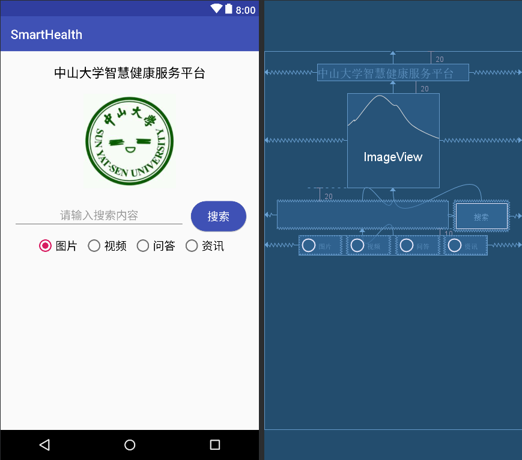

## 一、实验题目
中山大学智慧健康服务平台应用开发：基本的UI界面设计

---

## 二、实现内容
实现一个Android应用，界面呈现如图中的效果。  
  
#### 要求  
* 该界面为应用启动后看到的第一个界面。  
* 各控件的要求
  1. 标题字体大小**20sp**，与顶部距离**20dp**，居中；
  2. 图片与上下控件的间距均为**20dp**，居中；  
  3. 输入框整体距左右屏幕各间距**20dp**，内容（包括提示内容）如图所示，内容字体大小**18sp**；  
  4. 按钮与输入框间距**10dp**，文字大小**18sp**。按钮背景框左右边框与文字间距**10dp**，上下边框与文字间距**5dp**，圆角半径**180dp**，背景色为**#3F51B5**；  
  5. 四个单选按钮整体居中，与输入框间距10dp，字体大小**18sp**，各个单选按钮之间间距**10dp**，默认选中的按钮为第一个。

#### 使用的组件
TextView、EditText、ConstraintLayout、Button、ImageView、RadioGroup、RadioButton。

---

## 三、实验结果
### (1)实验截图


### (2)实验步骤以及关键代码
* 标题的实现；

  activity_main.xml:

  ```xml
  <TextView
      android:id="@+id/title"
      android:layout_width="wrap_content"
      android:layout_height="wrap_content"
      android:layout_marginTop="20dp"
      android:text="@string/title"
      android:textColor="#000000"
      android:textSize="20sp"
      app:layout_constraintLeft_toLeftOf="parent"
      app:layout_constraintRight_toRightOf="parent"
      app:layout_constraintTop_toTopOf="parent" />
  ```

  strings.xml:

  ```xml
  <string name="title">中山大学智慧健康服务平台</string>
  ```

* 图片的实现；

  ```xml
  <ImageView
      android:id="@+id/sysu"
      android:layout_width="wrap_content"
      android:layout_height="wrap_content"
      android:layout_marginTop="20dp"
      android:contentDescription="@string/sysu"
      android:src="@mipmap/sysu"
      app:layout_constraintEnd_toEndOf="parent"
      app:layout_constraintStart_toStartOf="parent"
      app:layout_constraintTop_toBottomOf="@id/title" />
  ```

* 输入框的实现；

  activity_main.xml:

  ```xml
  <EditText
      android:id="@+id/search_src_text"
      android:layout_width="0dp"
      android:layout_height="wrap_content"
      android:layout_marginStart="20dp"
      android:layout_marginLeft="20dp"
      android:layout_marginTop="20dp"
      android:layout_marginEnd="10dp"
      android:layout_marginRight="10dp"
      android:hint="@string/search_hint"
      android:textAlignment="center"
      android:inputType="text"
      android:textSize="18sp"
      app:layout_constraintEnd_toStartOf="@+id/search_button"
      app:layout_constraintStart_toStartOf="parent"
      app:layout_constraintTop_toBottomOf="@id/sysu"/>
  ```

  strings.xml:

  ```xml
  <string name="search_hint">请输入搜索内容</string>
  ```

* 搜索按钮的实现；

  activity_main.xml:

  ```xml
  <Button
        android:id="@+id/search_button"
        android:background="@drawable/button_rounded"
        android:text="@string/search"
        style="@style/MyButton"
        app:layout_constraintEnd_toEndOf="parent"
        app:layout_constraintStart_toEndOf="@+id/search_src_text"
        app:layout_constraintTop_toBottomOf="@id/sysu" />
  ```

  button_rounded.xml:

  ```xml
  <?xml version="1.0" encoding="utf-8"?>
  <shape xmlns:android="http://schemas.android.com/apk/res/android">
      <solid android:color="#3F51B5"/>
      <corners android:radius="180dp"/>
  </shape>
  ```

  strings.xml:

  ```xml
  <string name="search">搜索</string>
  ```

  styles.xml:

  ```xml
  <style name="MyButton">
      <item name="android:layout_width">wrap_content</item>
      <item name="android:layout_height">wrap_content</item>
      <item name="android:layout_marginTop">20dp</item>
      <item name="android:layout_marginEnd">20dp</item>
      <item name="android:layout_marginRight">20dp</item>
      <item name="android:paddingLeft">5dp</item>
      <item name="android:paddingTop">10dp</item>
      <item name="android:paddingRight">5dp</item>
      <item name="android:paddingBottom">10dp</item>
      <item name="android:textColor">#FFFFFF</item>
      <item name="android:textSize">18sp</item>
  </style>
  ```

* 单选按钮的实现。

  activity_main.xml:

  ```xml
  <RadioGroup
      android:id="@+id/category"
      android:layout_width="wrap_content"
      android:layout_height="wrap_content"
      android:layout_marginTop="10dp"
      android:orientation="horizontal"
      app:layout_constraintLeft_toLeftOf="parent"
      app:layout_constraintRight_toRightOf="parent"
      app:layout_constraintTop_toBottomOf="@id/search_src_text">

      <RadioButton
          android:id="@+id/img"
          android:checked="true"
          android:text="@string/img"
          style="@style/MyRadioButton"
          android:layout_marginRight="10dp"
          android:layout_marginEnd="10dp" />

      <RadioButton
          android:id="@+id/vid"
          android:text="@string/vid"
          style="@style/MyRadioButton"
          android:layout_marginRight="10dp"
          android:layout_marginEnd="10dp" />

      <RadioButton
          android:id="@+id/qa"
          android:text="@string/qa"
          style="@style/MyRadioButton"
          android:layout_marginRight="10dp"
          android:layout_marginEnd="10dp" />

      <RadioButton
          android:id="@+id/info"
          android:text="@string/info"
          style="@style/MyRadioButton" />
  </RadioGroup>
  ```

  strings.xml:

  ```xml
  <string name="img">图片</string>
  <string name="vid">视频</string>
  <string name="qa">问答</string>
  <string name="info">资讯</string>
  ```

  styles.xml:
  
  ```xml
  <style name="MyRadioButton">
      <item name="android:layout_width">wrap_content</item>
      <item name="android:layout_height">wrap_content</item>
      <item name="android:textSize">18sp</item>
  </style>
  ```

### (3)实验遇到的困难以及解决思路

问题：刚开始设计的时候，我不知道如何拉伸输入框的宽度，输入框的宽度很小。

解决方法：查询资料后发现，只要将布局宽度设为0dp，输入框的宽度就会自动伸缩，适应约束条件的要求。

---

## 四、实验思考及感想
  在本次实验中，我做出了我的第一个Android应用。这是一个简单的静态应用页面，具有TextView、EditText、ConstraintLayout、Button、ImageView、RadioGroup、RadioButton等控件。

  在实验中，我学到了许多有趣并且有用的知识，例如xml的结构和用法、Android应用开发环境的搭建、git的使用方法、应用的调试方法等等，很好地锻炼了我的程序设计能力。成功做出应用，也是对努力学习的一种回报，将继续鼓励着我学习Android开发的基本以及进阶知识。