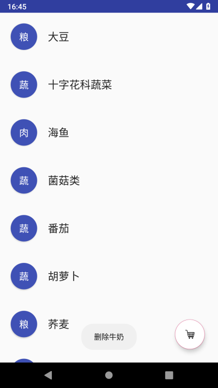
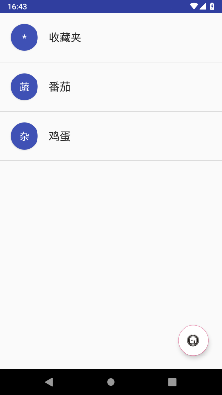
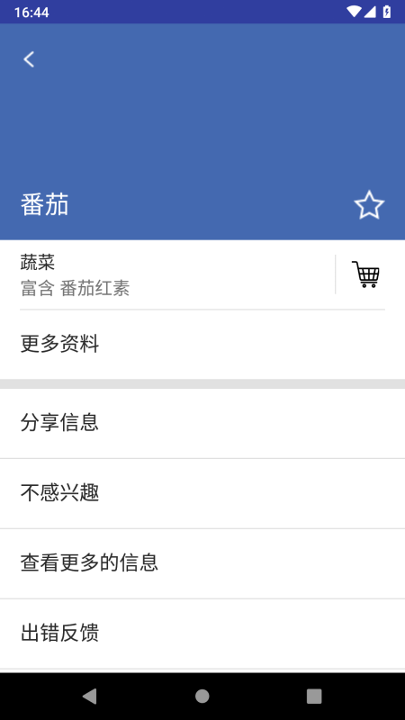
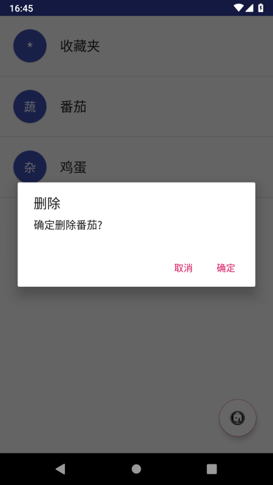

# 中山大学数据科学与计算机学院本科生实验报告
## （2018年秋季学期）
| 课程名称 | 手机平台应用开发 | 任课老师 | 郑贵锋 |
| :------------: | :-------------: | :------------: | :-------------: |
| 年级 | 2016级 | 专业（方向） | 软件工程（数字媒体） |
| 学号 | 16340109 | 姓名 | 黎汛言 |
| 电话 | 15899822193 | Email | lixy248@mail2.sysu.edu.cn |
| 开始日期 | 2018.10.11 | 完成日期 | 2018.10.17 |

---

## 一、实验题目
中山大学智慧健康服务平台应用开发：Intent、Bundle 的使用以及 RecyclerView、ListView 的应用

---

## 二、实现内容
本次实验模拟实现一个健康食品列表，有两个界面，第一个界面用于呈现食品列表 如下所示  
  
数据在"manual/素材"目录下给出。  
点击右下方的悬浮按钮可以切换到收藏夹  
   
上面两个列表点击任意一项后，可以看到详细的信息：  
 

#### UI要求  
* 食品列表  
      每一项为一个圆圈和一个名字，圆圈和名字都是垂直居中。圆圈内的内容是该食品的种类，内容要处于圆圈的中心，颜色为白色。食品名字为黑色，圆圈颜色自定义，只需能看见圆圈内的内容即可。
* 收藏夹  
      与食品列表相似
* 食品详情界面  
   1. 界面顶部  
     
   顶部占整个界面的1/3。每个食品详情的顶部颜色在数据中已给出。返回图标处于这块区域的左上角，食品名字处于左下角，星标处于右下角，边距可以自己设置。 **返回图标与名字左对齐，名字与星标底边对齐。** 建议用RelativeLayout实现，以熟悉RelativeLayout的使用。  
   2. 界面中部  
     
   使用的黑色argb编码值为#D5000000，稍微偏灰色的“富含”“蛋白质”的argb编码值为#8A000000。"更多资料"一栏上方有一条分割线，argb编码值为#1E000000。右边收藏符号的左边也有一条分割线，要求与收藏符号高度一致，垂直居中。字体大小自定。"更多资料"下方分割线高度自定。这部分所有的分割线argb编码值都是#1E000000。  
   3. 界面底部  
     
   使用的黑色argb编码值为#D5000000。  
* 标题栏  
      两个界面的标题栏都需要去掉  

#### 功能要求
* 使用RecyclerView实现食品列表。点击某个食品会跳转到该食品的详情界面，呈现该食品的详细信息。长按列表中某个食品会删除该食品，并弹出Toast，提示 **"删除XX"** 。
* 点击右下方的FloatingActionButton，从食品列表切换到收藏夹或从收藏夹切换到食品列表，并且该按钮的图片作出相应改变。
* 使用ListView实现收藏夹。点击收藏夹的某个食品会跳转到食品详情界面，呈现该食品的详细信息。长按收藏夹中的某个食品会弹出对话框询问是否移出该食品，点击确定则移除该食品，点击取消则对话框消失。如长按“鸡蛋”，对话框内容如下图所示。  

* 商品详情界面中点击返回图标会返回上一层。点击星标会切换状态，如果原本是空心星星，则会变成实心星星；原本是实心星星，则会变成空心星星。点击收藏图表则将该食品添加到收藏夹并弹出Toast提示 **"已收藏"** 。
---

## 三、实验结果
### (1)实验截图




### (2)实验步骤以及关键代码
* 食品列表

  * UI部分

    在布局文件activity_main.xml中创建RecyclerView：

    ```xml
    <android.support.v7.widget.RecyclerView
        android:id="@+id/my_recycler_view"
        android:layout_width="match_parent"
        android:layout_height="match_parent"
        android:visibility="visible"/>
    ```

    在布局文件food_item.xml中定义列表项的布局：

    ```xml
    <android.support.constraint.ConstraintLayout xmlns:android="http://schemas.android.com/apk/res/android"
        xmlns:app="http://schemas.android.com/apk/res-auto"
        android:layout_width="match_parent"
        android:layout_height="wrap_content">
        <Button
            android:id="@+id/category_first"
            android:layout_width="50dp"
            android:layout_height="50dp"
            android:background="@drawable/button_rounded"
            android:layout_margin="20dp"
            android:textSize="18sp"
            android:textColor="@color/colorWhite"
            android:focusable="false"
            android:focusableInTouchMode="false"
            app:layout_constraintTop_toTopOf="parent"
            app:layout_constraintBottom_toBottomOf="parent"
            app:layout_constraintLeft_toLeftOf="parent" />
        <TextView
            android:id="@+id/name"
            android:layout_width="wrap_content"
            android:layout_height="wrap_content"
            android:layout_margin="20dp"
            android:textSize="20sp"
            android:textColor="@color/colorBlack"
            app:layout_constraintTop_toTopOf="parent"
            app:layout_constraintBottom_toBottomOf="parent"
            app:layout_constraintLeft_toRightOf="@id/category_first" />
    </android.support.constraint.ConstraintLayout>
    ```

    自定义ViewHolder：

    ```java
    // Provide a reference to the views for each data item
    public static class MyViewHolder extends RecyclerView.ViewHolder {
        private SparseArray<View> views;
        private View view;

        public MyViewHolder(Context _context, View _view, ViewGroup _viewGroup) {
            super(_view);
            view = _view;
            views = new SparseArray<View>();
        }
        public static MyViewHolder get(Context _context, ViewGroup _viewGroup, int _layoutId) {
            View _view = LayoutInflater.from(_context).inflate(_layoutId, _viewGroup, false);
            return new MyViewHolder(_context, _view, _viewGroup);
        }
        public <T extends View> T getView(int _viewId) {
            View _view = views.get(_viewId);
            if (_view == null) {
                // 创建view
                _view = view.findViewById(_viewId);
                // 将view存入views
                views.put(_viewId, _view);
            }
            return (T)_view;
        }
    }
    ```

    利用自定义的ViewHolder，自定义RecyclerViewAdapter（关键代码）：

    ```java
    // Provide a suitable constructor (depends on the kind of dataset)
    public MyRecyclerViewAdapter(Context _context, int _layoutId, List _data) {
        context = _context;
        layoutId = _layoutId;
        data = _data;
    }
    // Create new views (invoked by the layout manager)
    @Override
    public MyRecyclerViewAdapter.MyViewHolder onCreateViewHolder(ViewGroup parent,
                                                     int viewType) {
        MyViewHolder vh = MyViewHolder.get(context, parent, layoutId);
        return vh;
    }

    // Replace the contents of a view (invoked by the layout manager)
    @Override
    public void onBindViewHolder(final MyViewHolder holder, int position) {
        // - get element from your dataset at this position
        // - replace the contents of the view with that element
        convert(holder, data.get(position)); // convert函数需要重写
        if (onItemClickListener != null) {
            holder.itemView.setOnClickListener(new View.OnClickListener() {
                @Override
                public void onClick(View view) {
                    onItemClickListener.onClick(holder.getAdapterPosition());
                }
            });
            holder.itemView.setOnLongClickListener(new View.OnLongClickListener() {
                @Override
                public boolean onLongClick(View view) {
                    onItemClickListener.onLongClick(holder.getAdapterPosition());
                    return false;
                }
            });
        }
    }
    ```

    用一个List<Map<String, Object>>对象保存食品信息：

    ```java
    List<Map<String, Object>> data = new ArrayList<>();
    for (int i = 0; i < foodName.length; i++) {
        Map<String, Object> temp = new LinkedHashMap<>();
        temp.put("name", foodName[i]);
        temp.put("first", foodCategoryFirst[i]);
        temp.put("category", foodCategory[i]);
        temp.put("nutrient", foodNutrient[i]);
        temp.put("color", foodColor[i]);
        data.add(temp);
    }
    ```
    用列表data创建Adapter，并将Adapter绑定到RecyclerView上

    ```java
    // specify an adapter
    mRecyclerViewAdapter = new MyRecyclerViewAdapter(this, R.layout.food_item, data) {
        @Override
        public void convert(MyViewHolder holder, Map m) {
            TextView name = holder.getView(R.id.name);
            name.setText(m.get("name").toString());
            Button first = holder.getView(R.id.category_first);
            first.setText(m.get("first").toString());
        }
    };
    ScaleInAnimationAdapter scaleInAnimationAdapter = new ScaleInAnimationAdapter(mRecyclerViewAdapter);
    scaleInAnimationAdapter.setDuration(1000);
    mRecyclerView.setAdapter((scaleInAnimationAdapter));
    mRecyclerView.setItemAnimator(new OvershootInLeftAnimator());
    ```
    
  * 功能部分

    通过如下接口定义MyRecyclerViewAdapterd的点击事件监听器：

    ```java
    public interface OnItemClickListener{
        void onClick(int position);
        void onLongClick(int position);
    }
    ```

    通过以下函数绑定监听器：

    ```java
    public void setOnItemClickListener(OnItemClickListener _onItemClickListener) {
        onItemClickListener = _onItemClickListener;
    }
    ```

    当itemView被点击时，调用Adapter中的监听器，并将被点击item的position传递给监听器：

    ```java
    if (onItemClickListener != null) {
        holder.itemView.setOnClickListener(new View.OnClickListener() {
            @Override
            public void onClick(View view) {
                onItemClickListener.onClick(holder.getAdapterPosition());
            }
        });
        holder.itemView.setOnLongClickListener(new View.OnLongClickListener() {
            @Override
            public boolean onLongClick(View view) {
                onItemClickListener.onLongClick(holder.getAdapterPosition());
                return false;
            }
        });
    }
    ```

    调用MyRecyclerViewAdapter.setOnItemClickListener，传入一个新的OnItemClickListener对象，并重写onClick和onLongClick函数，实现食品的删除和页面跳转传参。单击时，将食品的位置、名字等信息添加到itent中，传给新的Activity，并等待返回结果。长按时，根据食品的位置，在列表中删除食品。


    ```java
    ((MyRecyclerViewAdapter) mRecyclerViewAdapter).setOnItemClickListener(new MyRecyclerViewAdapter.OnItemClickListener() {
        @Override
        public void onClick(int position) {
            Map<String, Object> item = ((MyRecyclerViewAdapter) mRecyclerViewAdapter).data.get(position);
            Intent intent = new Intent(MainActivity.this, DetailActivity.class);
            intent.putExtra("position", position);
            intent.putExtra("name", item.get("name").toString());
            intent.putExtra("category", item.get("category").toString());
            intent.putExtra("nutrient", item.get("nutrient").toString());
            intent.putExtra("color", item.get("color").toString());
            startActivityForResult(intent, 1);
        }

        @Override
        public void onLongClick(int position) {
            String name = ((MyRecyclerViewAdapter) mRecyclerViewAdapter).data.get(position).get("name").toString();
            ((MyRecyclerViewAdapter) mRecyclerViewAdapter).data.remove(position);
            mRecyclerViewAdapter.notifyDataSetChanged();
            Toast.makeText(getApplicationContext(), "删除" + name,
                    Toast.LENGTH_SHORT).show();
        }
    });
    ```

* 收藏夹

  * UI部分

    在布局文件activity_main.xml中创建ListView：

    ```xml
    <ListView
        android:id="@+id/my_list_view"
        android:layout_width="match_parent"
        android:layout_height="match_parent"
        android:visibility="invisible"/>
    ```

    自定义ListViewAdapter（关键代码）：

    ```java
    public MyListViewAdapter(Context _context) {
        context = _context;
        Map<String, Object> init = new LinkedHashMap<>();
        init.put("name", "收藏夹");
        init.put("first", "*");
        data.add(init);
    }
    @Override
    public View getView(int i, View view, ViewGroup viewGroup) {
        // 新声明一个View变量和ViewHolder变量,ViewHolder类在下面定义。
        View convertView;
        ViewHolder viewHolder;
        // 当view为空时才加载布局，否则，直接修改内容
        if (view == null) {
            // 通过inflate的方法加载布局，context需要在使用这个Adapter的Activity中传入。
            convertView= LayoutInflater.from(context).inflate(R.layout.food_item, null);
            viewHolder = new ViewHolder();
            viewHolder.name = convertView.findViewById(R.id.name);
            viewHolder.first = convertView.findViewById(R.id.category_first);
            convertView.setTag(viewHolder); // 用setTag方法将处理好的viewHolder放入view中
        } else { // 否则，让convertView等于view，然后从中取出ViewHolder即可
            convertView = view;
            viewHolder = (ViewHolder) convertView.getTag();
        }
        // 从viewHolder中取出对应的对象，然后赋值给他们
        viewHolder.name.setText(data.get(i).get("name").toString());
        viewHolder.first.setText(data.get(i).get("first").toString());
        // 将这个处理好的view返回
        return convertView;
    }
    private class ViewHolder {
        public Button first;
        public TextView name;
    }
    ```
  
    创建Adapter，并将Adapter绑定到ListView上：

    ```java
    mListViewAdapter = new MyListViewAdapter(this);
    mListView.setAdapter(mListViewAdapter);
    ```

  * 功能部分

    分别编写setOnItemClickListener和setOnItemLongClickListener，处理单击和长按事件，实现弹出对话框、删除收藏内容和页面跳转传参。单击时，将食品的位置、名字等信息添加到itent中，传给新的Activity，并等待返回结果。长按时，弹出对话框。若点击确认，则根据食品的位置，在收藏列表中删除食品。

    ```java
    mListView.setOnItemClickListener(new AdapterView.OnItemClickListener() {
            @Override
            public void onItemClick(AdapterView<?> parent, View view, int position, long id) {
                if (position != 0) {
                    Map<String, Object> item = ((MyListViewAdapter) mListViewAdapter).data.get(position);
                    Intent intent = new Intent(MainActivity.this, DetailActivity.class);
                    intent.putExtra("position", position);
                    intent.putExtra("name", item.get("name").toString());
                    intent.putExtra("category", item.get("category").toString());
                    intent.putExtra("nutrient", item.get("nutrient").toString());
                    intent.putExtra("color", item.get("color").toString());
                    startActivityForResult(intent, 2);
                }
            }
        });
        mListView.setOnItemLongClickListener(new AdapterView.OnItemLongClickListener() {
            @Override
            public boolean onItemLongClick(AdapterView<?> parent, View view, final int position, long id) {
                if (position != 0) {
                    Map<String, Object> item = ((MyListViewAdapter) mListViewAdapter).data.get(position);
                    alertDialog.setPositiveButton("确定", new DialogInterface.OnClickListener() {
                        @Override
                        public void onClick(DialogInterface dialog, int which) {
                            ((MyListViewAdapter)mListViewAdapter).data.remove(position);
                            mListViewAdapter.notifyDataSetChanged();
                        }
                    }).setNegativeButton("取消", null).setMessage(
                            "确定删除" + item.get("name").toString() + "?").show();
                    return true;
                }
                return false;
            }
        });
    ```

* 食品详情界面

  * UI部分

    用LinearLayout的weight值来实现顶部占页面三分之一。在顶部内用RelativeLayout实现内容对齐：
    ```xml
    <LinearLayout
        android:id="@+id/top_panel"
        android:layout_width="match_parent"
        android:layout_height="0dp"
        android:layout_weight="1">
        <RelativeLayout
            android:layout_width="match_parent"
            android:layout_height="match_parent">
            <ImageButton
                android:id="@+id/back"
                android:layout_width="wrap_content"
                android:layout_height="wrap_content"
                android:src="@mipmap/back"
                android:background="#00000000"
                android:layout_margin="20dp"/>
            <TextView
                android:id="@+id/food_name"
                android:layout_width="wrap_content"
                android:layout_height="wrap_content"
                android:layout_alignParentBottom="true"
                android:textColor="@color/colorWhite"
                android:textSize="25sp"
                android:layout_margin="20dp"/>
            <ImageButton
                android:id="@+id/star"
                android:layout_width="wrap_content"
                android:layout_height="wrap_content"
                android:src="@mipmap/empty_star"
                android:background="#00000000"
                android:layout_alignParentBottom="true"
                android:layout_alignParentRight="true"
                android:layout_margin="20dp"/>
        </RelativeLayout>
    </LinearLayout>
    ```

    中部用RelativeLayout实现第一行的内容：
    
    ```xml
    <RelativeLayout
        android:layout_width="match_parent"
        android:layout_height="70dp">
        <TextView
            android:id="@+id/food_category"
            android:layout_width="wrap_content"
            android:layout_height="wrap_content"
            android:layout_marginTop="10dp"
            android:layout_marginLeft="20dp"
            android:textSize="18sp"
            android:textColor="@color/colorBlack" />
        <TextView
            android:id="@+id/food_nutrient"
            android:layout_width="wrap_content"
            android:layout_height="wrap_content"
            android:layout_marginBottom="10dp"
            android:layout_marginLeft="20dp"
            android:textSize="18sp"
            android:textColor="@color/colorGrey"
            android:layout_alignParentBottom="true"/>
        <ImageButton
            android:id="@+id/collect"
            android:layout_width="40dp"
            android:layout_height="40dp"
            android:scaleX="0.7"
            android:scaleY="0.7"
            android:layout_marginRight="20dp"
            android:layout_marginTop="15dp"
            android:src="@mipmap/collect"
            android:background="#00000000"
            android:layout_alignParentRight="true" />
        <View
            android:layout_width="1dp"
            android:layout_height="40dp"
            android:layout_marginRight="10dp"
            android:layout_marginTop="15dp"
            android:layout_marginBottom="15dp"
            android:background="@color/colorDivide"
            android:layout_toLeftOf="@id/collect"/>
    </RelativeLayout>
    ```

    底部用ListView和ArrayAdapter的绑定实现：

    ```xml
    <ListView
            android:id="@+id/bottom_panel"
            android:layout_width="match_parent"
            android:layout_height="match_parent"/>
    ```

    ```java
    String[] operations = 
            new String[] {"分享信息", "不感兴趣", "查看更多的信息", "出错反馈"};
    ArrayAdapter<String> bottomArrayAdapter = new ArrayAdapter<>(
            this, R.layout.bottom_item, operations);
    bottom_list.setAdapter(bottomArrayAdapter);
    ```

  * 功能部分

    启动Activity时，在intent里获取食品的信息，填充到页面中：

    ```java
    Bundle extras = getIntent().getExtras();
    if (extras != null) {
        position = extras.getInt("position");
        name = extras.getString("name");
        category = extras.getString("category");
        nutrient = extras.getString("nutrient");
        color = extras.getString("color");
    }
    foodName.setText(name);
    foodCategory.setText(category);
    foodNutrient.setText("富含 " + nutrient);
    topPanel.setBackgroundColor(Color.parseColor(color));
    ```
  
    点击收藏按钮时，将tag设为1。若点击返回键时，收藏按钮的tag为1，则在intent中添加食品的position信息，返回给上一个页面，进行收藏操作：

    ```java
    collect.setOnClickListener(new View.OnClickListener() {
        @Override
        public void onClick(View v) {
            collect.setTag(1);
            Toast.makeText(getApplicationContext(), "已收藏", Toast.LENGTH_SHORT).show();
        }
    });
    back.setOnClickListener(new View.OnClickListener() {
        @Override
        public void onClick(View v) {
            if (collect.getTag().equals(1)) {
                Bundle bundle = new Bundle();
                bundle.putInt("position", position);
                Intent mIntent = new Intent();
                mIntent.putExtras(bundle);
                setResult(RESULT_OK, mIntent);
            }
            else {
                setResult(RESULT_CANCELED);
            }
            finish();
        }
    });
    ```

    点击星星时，判断星星按钮的tag，来更换图片：

    ```java
    star.setOnClickListener(new View.OnClickListener() {
        @Override
        public void onClick(View v) {
            if (star.getTag().equals(0)) {
                star.setTag(1);
                star.setImageResource(R.mipmap.full_star);
            }
            else {
                star.setTag(0);
                star.setImageResource(R.mipmap.empty_star);
            }
        }
    });
    ```

* 获取收藏信息

  在MainActivity.java中重载onActivityResult函数。若requestCode为1，则根据传回的position，将食品列表对应位置的食品添加到收藏列表；若requestCode为2，则根据传回的position，将收藏列表对应位置的食品重复添加到收藏列表。

  ```java
  @Override
  protected void onActivityResult(int requestCode, int resultCode, Intent data) {
      super.onActivityResult(requestCode, resultCode, data);
      if (resultCode == RESULT_OK) {
          if (requestCode == 1) {
              int position = data.getExtras().getInt("position");
              Map<String, Object> item = ((MyRecyclerViewAdapter) mRecyclerViewAdapter).data.get(position);
              ((MyListViewAdapter)mListViewAdapter).data.add(item);
              mListViewAdapter.notifyDataSetChanged();
          }
          else if (requestCode == 2) {
              int position = data.getExtras().getInt("position");
              Map<String, Object> item = ((MyListViewAdapter) mListViewAdapter).data.get(position);
              ((MyListViewAdapter)mListViewAdapter).data.add(item);
              mListViewAdapter.notifyDataSetChanged();
          }
      }
  }
  ```

* 食品列表和收藏列表的切换
  
  点击悬浮按钮时，改变两个列表的可见性，同时改变按钮的背景图片，即可实现列表的切换显示：

  ```java
  mFloatingActionButton.setOnClickListener(new View.OnClickListener() {
      @Override
      public void onClick(View view) {
          if (mRecyclerView.getVisibility() == View.VISIBLE) {
              mRecyclerView.setVisibility(View.INVISIBLE);
              mListView.setVisibility(View.VISIBLE);
              mFloatingActionButton.setImageResource(R.mipmap.mainpage);
          }
          else {
              mRecyclerView.setVisibility(View.VISIBLE);
              mListView.setVisibility(View.INVISIBLE);
              mFloatingActionButton.setImageResource(R.mipmap.collect);
          }
      }
  });
  ```

### (3)实验遇到的困难以及解决思路

* ListView调用了setOnItemClickListener和setOnItemLongClickListener后，仍然无法响应点击事件。
  解决方法：问题产生的原因是食品列表项中存在Button。当View中有Button时，ListView会屏蔽OnItemClickListener和OnItemLongClickListener，以免和按钮的功能冲突。给按钮添加`android:focusable="false"`和`android:focusableInTouchMode="false"`属性后，即可解决问题。

* 删除食品后，食品列表不变化。
  解决方法：调用RecyclerViewAdapter的notifyDataSetChanged()方法，可以刷新RecyclerView的内容。

---

## 五、实验思考及感想
  在本次实验中，我实现了一个简单的食品列表，学会了Intent、Bundle的使用以及RecyclerView、ListView的应用。

  在实验中，我学到了许多有趣并且有用的知识，例如安卓消息传递的基本方法，Adapter、ViewHolder这些实用的设计模式，进一步了解了安卓编程的方法特点，提升了程序设计的能力。通过复杂的编程实验，我也逐步掌握了安卓应用的测试和调试方法，debug的速度较以往有所提升。