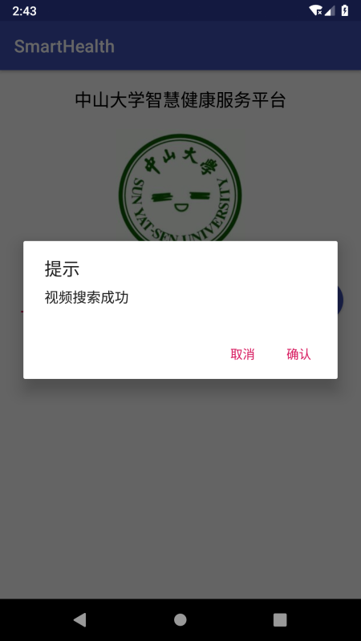
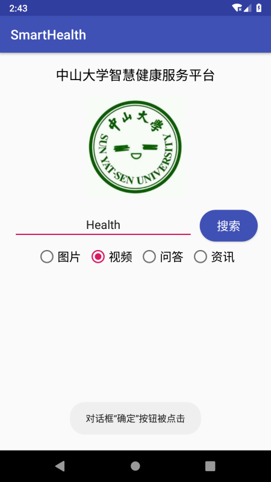
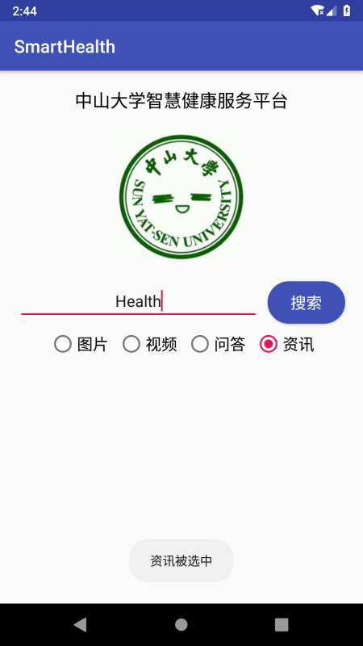
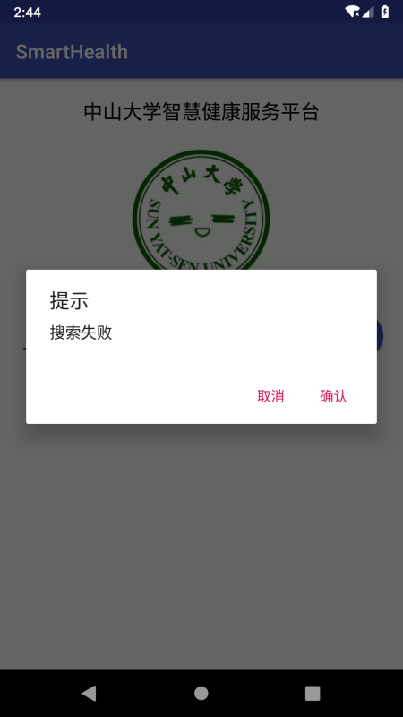

## 一、实验题目
中山大学智慧健康服务平台应用开发：基础的事件处理

---

## 二、实现内容
实现一个Android应用，界面呈现如图中的效果。  
  
#### 要求  
* 该界面为应用启动后看到的第一个界面。  
* 各控件处理的要求
  1. 点击搜索按钮：
    * 如果搜索内容为空，弹出Toast信息“**搜索内容不能为空**”。
    * 如果搜索内容为“Health”，根据选中的RadioButton项弹出如下对话框。  
    
  点击“确定”，弹出Toast信息——**对话框“确定”按钮被点击**。  
  点击“取消”，弹出Toast 信息——**对话框“取消”按钮被点击**。  
  否则弹出如下对话框，对话框点击效果同上。  
    
  2. RadioButton选择项切换：选择项切换之后，弹出Toast信息“**XX被选中**”，例如从图片切换到视频，弹出Toast信息“**视频被选中**”  
---

## 三、实验结果
### (1)实验截图




### (2)实验步骤以及关键代码
* 构造一个对话框，设置标题和按钮，并为按钮绑定事件监听器，用事件处理函数弹出相应的Toast信息；

  MainActivity.java:

  ```java
  final AlertDialog.Builder alertDialog = new AlertDialog.Builder(this);
  alertDialog.setTitle(R.string.dialog_title).setPositiveButton(R.string.positive_btn_text,
          new DialogInterface.OnClickListener() {
              @Override
              public void onClick(DialogInterface dialog, int which) {
                  Toast.makeText(getApplicationContext(),
                          R.string.confirm_msg, Toast.LENGTH_SHORT).show();
              }
          }).setNegativeButton(R.string.negative_btn_text,
          new DialogInterface.OnClickListener() {
              @Override
              public void onClick(DialogInterface dialog, int which) {
                  Toast.makeText(getApplicationContext(),
                          R.string.cancel_msg, Toast.LENGTH_SHORT).show();
              }
          }).create();
  ```

  strings.xml:

  ```xml
  <string name="confirm_msg">对话框“确定”按钮被点击</string>
  <string name="cancel_msg">对话框“取消”按钮被点击</string>
  <string name="dialog_title">提示</string>
  <string name="positive_btn_text">确认</string>
  <string name="negative_btn_text">取消</string>
  ```

* 给搜索按钮绑定事件监听器，用事件处理函数弹出对话框；

  MainActivity.java:

  ```java
  Button btn = findViewById(R.id.search_button);
  if (btn != null) {
      btn.setOnClickListener(new View.OnClickListener() {
          @Override
          public void onClick(View v) {
              EditText search_content = findViewById(R.id.search_src_text);
              RadioGroup category = findViewById(R.id.category);
              RadioButton checked_btn = findViewById(category.getCheckedRadioButtonId());
              if (TextUtils.isEmpty(search_content.getText().toString())) {
                  Toast.makeText(getApplicationContext(),
                          R.string.empty_msg, Toast.LENGTH_SHORT).show();
              } else if (TextUtils.equals(search_content.getText().toString(), getString(R.string.search_target))) {
                  alertDialog.setMessage(checked_btn.getText().toString() + getString(R.string.succeed_msg)).show();
              } else {
                  alertDialog.setMessage(R.string.fail_msg).show();
              }
          }
      });
  }
  ```

  strings.xml:

  ```xml
  <string name="succeed_msg">搜索成功</string>
  <string name="fail_msg">搜索失败</string>
  <string name="search_target">Health</string>
  ```

* 利用RadioGroup.setOnCheckedChangeListener来监控单选按钮的状态变化，产生相应的Toast信息。

  MainActivity.java:

  ```java
  public void setRadioGroupOnCheckedChangeListener() {
      RadioGroup category = findViewById(R.id.category);
      category.setOnCheckedChangeListener(new RadioGroup.OnCheckedChangeListener() {
          @Override
          public void onCheckedChanged(RadioGroup group, int checkedId) {
              RadioButton checked_btn = findViewById(checkedId);
              Toast.makeText(getApplicationContext(),
                      checked_btn.getText().toString() + getString(R.string.was_chosen), Toast.LENGTH_SHORT).show();
          }
      });
  }
  ```

  strings.xml:

  ```xml
  <string name="was_chosen">被选中</string>
  ```

### (3)实验遇到的困难以及解决思路

问题：在对话框和Toast信息中使用strings.xml中定义的字符串时，不显示字符串，而是显示一串数字。

解决方法:通过getString()方法获取到对应的字符串，即可解决问题。

---

## 四、实验思考及感想
  在本次实验中，我进一步完善了我的第一个Android应用，实现了简单的Android事件处理。通过给按钮绑定简单的事件监听器，我实现了Toast信息和对话框的显示和基本交互。

  在实验中，我学到了许多有趣并且有用的知识，例如java程序设计方法、事件监听器的使用、函数的链式调用等等，巩固了程序设计的知识。