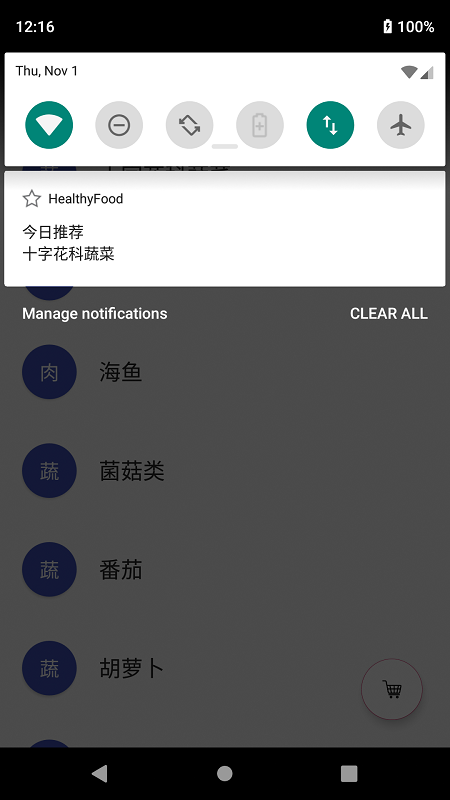
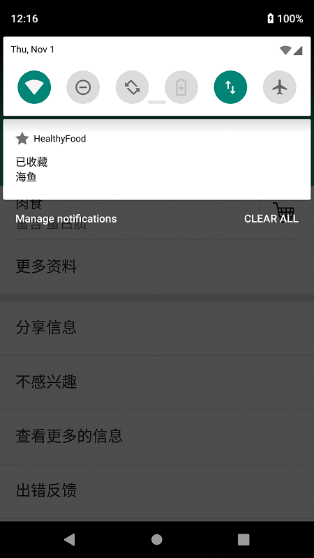
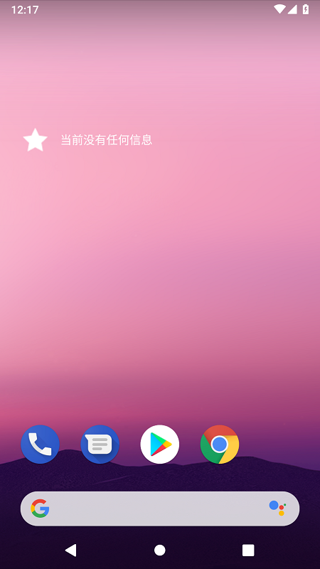

## 一、实验题目
中山大学智慧健康服务平台应用开发：Broadcast和AppWidget的使用

---

## 二、实现内容
### 在第六周任务的基础上，实现静态广播、动态广播两种改变Notification 内容的方法。  

#### 要求  
* 在启动应用时，会有通知产生，随机推荐一个食品。  
 
* 点击通知跳转到所推荐食品的详情界面。  
  
* 点击收藏图标，会有对应通知产生，并通过Eventbus在收藏列表更新数据。  
  
* 点击通知返回收藏列表。  
  
* 实现方式要求:启动页面的通知由静态广播产生，点击收藏图标的通知由动态广播产生。   

### 在第七周任务的基础上，实现静态广播、动态广播两种改变widget内容的方法。  

#### 要求 
* widget初始情况如下：      
 
* 点击widget可以启动应用，并在widget随机推荐一个食品。      

* 点击widget跳转到所推荐食品的详情界面。     
 
* 点击收藏图标，widget相应更新。     
 
* 点击widget跳转到收藏列表。     
 
* 实现方式要求:启动时的widget更新通过静态广播实现，点击收藏图标时的widget更新通过动态广播实现。 

---

## 三、实验结果
### (1)实验截图





### (2)实验步骤以及关键代码

#### 第七周任务

* 静态广播和通知产生
  
  定义静态广播类StaticReceiver用于接收广播，重写onReceive方法，当接收到对应广播时，产生通知。

  ```java
  public class StaticReceiver extends BroadcastReceiver {
      private static final String STATICACTION = "com.xungerrrr.healthyfood.MyStaticFilter";
      @Override
      public void onReceive(Context context, Intent intent) {
          if (intent.getAction().equals(STATICACTION)) {
              Bundle bundle = intent.getExtras();
              Notification.Builder builder = new Notification.Builder(context);
              Intent contentIntent = new Intent(context, DetailActivity.class);
              contentIntent.putExtras(bundle);
              contentIntent.setFlags(Intent.FLAG_ACTIVITY_NEW_TASK);
              PendingIntent resultPendingIntent = PendingIntent.getActivity(context,1, contentIntent, PendingIntent.FLAG_UPDATE_CURRENT);
              //对Builder进行配置，此处仅选取了几个
              builder.setContentTitle("今日推荐")   //设置通知栏标题：发件人
                      .setContentText(bundle.getString("name"))   //设置通知栏显示内容：短信内容
                      .setTicker("今日推荐 " + bundle.getString("name"))   //通知首次出现在通知栏，带上升动画效果的
                      .setSmallIcon(R.mipmap.empty_star)   //设置通知小ICON（通知栏），可以用以前的素材，例如空星
                      .setContentIntent(resultPendingIntent)   //传递内容
                      .setAutoCancel(true)   //设置这个标志当用户单击面板就可以让通知将自动取消
                      .setWhen(System.currentTimeMillis());
              //获取状态通知栏管理
              NotificationManager manager = (NotificationManager) context.getSystemService(Context.NOTIFICATION_SERVICE);
              //安卓8.0以上需要给通知分配NotificationChannel
              if (Build.VERSION.SDK_INT >= Build.VERSION_CODES.O) {
                  CharSequence name = context.getString(R.string.startup_channel_name);
                  int importance = NotificationManager.IMPORTANCE_HIGH;
                  NotificationChannel channel = new NotificationChannel("start", name, importance);
                  manager.createNotificationChannel(channel);
                  builder.setChannelId("start");
              }
              //绑定Notification，发送通知请求
              Notification notify = builder.build();
              manager.notify(0, notify);
          }
      }
  }
  ```

  在AndroidMainfest.xml中注册静态接收器

  ```xml
  <receiver android:name=".StaticReceiver">
      <intent-filter>
          <action android:name="com.xungerrrr.healthyfood.MyStaticFilter" />
      </intent-filter>
  </receiver>
  ```

  在主界面的onCreate()中发送广播

  ```java
  Random random = new Random();
  int position = random.nextInt(9); //返回一个0到n-1的整数
  Intent intentBroadcast = new Intent(STATICACTION); //定义Intent
  Bundle bundle = new Bundle();
  bundle.putInt("position", position);
  bundle.putString("name", data.get(position).get("name").toString());
  bundle.putString("category", data.get(position).get("category").toString());
  bundle.putString("nutrient", data.get(position).get("nutrient").toString());
  bundle.putString("color", data.get(position).get("color").toString());
  bundle.putInt("requestCode", 1);
  intentBroadcast.putExtras(bundle);
  intentBroadcast.setComponent(new ComponentName(getPackageName(),getPackageName() + ".StaticReceiver"));
  sendBroadcast(intentBroadcast);
  ```

* 动态广播、通知产生和EventBus使用

  定义动态广播类DynamicReceiver用于接收广播，重写onReceive方法，当接收到对应广播时，产生通知。

  ```java
  public class DynamicReceiver extends BroadcastReceiver {
  private static final String DYNAMICACTION = "com.xungerrrr.healthyfood.MyDynamicFilter";
  private static final String WIDGETDYNAMICACTION = "com.xungerrrr.healthyfood.MyWidgetDynamicFilter";
  @Override
  public void onReceive(Context context, Intent intent)  {
      if (intent.getAction().equals(DYNAMICACTION)) {
          Bundle bundle = intent.getExtras();
          Notification.Builder builder = new Notification.Builder(context);
          Intent contentIntent = new Intent(context, MainActivity.class);
          contentIntent.putExtras(bundle);
          contentIntent.setFlags(Intent.FLAG_ACTIVITY_NEW_TASK);
          PendingIntent resultPendingIntent = PendingIntent.getActivity(context, 0, contentIntent, PendingIntent.FLAG_UPDATE_CURRENT);
          //对Builder进行配置，此处仅选取了几个
          builder.setContentTitle("已收藏")   //设置通知栏标题：发件人
                  .setContentText(bundle.getString("name"))   //设置通知栏显示内容：短信内容
                  .setTicker("已收藏 " + bundle.getString("name"))   //通知首次出现在通知栏，带上升动画效果的
                  .setSmallIcon(R.mipmap.full_star)   //设置通知小ICON（通知栏），可以用以前的素材，例如空星
                  .setContentIntent(resultPendingIntent)   //传递内容
                  .setAutoCancel(true)   //设置这个标志当用户单击面板就可以让通知将自动取消
                  .setWhen(System.currentTimeMillis());

          //获取状态通知栏管理
          NotificationManager manager = (NotificationManager) context.getSystemService(Context.NOTIFICATION_SERVICE);
          //安卓8.0以上需要给通知分配NotificationChannel
          if (Build.VERSION.SDK_INT >= Build.VERSION_CODES.O) {
              CharSequence name = context.getString(R.string.collect_channel_name);
              int importance = NotificationManager.IMPORTANCE_HIGH;
              NotificationChannel channel = new NotificationChannel("collect", name, importance);
              manager.createNotificationChannel(channel);
              builder.setChannelId("collect");
          }
          //绑定Notification，发送通知请求
          Notification notify = builder.build();
          manager.notify(1, notify);
      }
  }
  ```

  在详情界面的onCreate()中注册广播

  ```java
  DynamicReceiver dynamicReceiver = new DynamicReceiver();
  IntentFilter dynamicFilter = new IntentFilter();
  dynamicFilter.addAction(DYNAMICACTION);    //添加动态广播的Action
  registerReceiver(dynamicReceiver, dynamicFilter);    //注册自定义动态广播消息
  ```

  在离开详情界面时注销广播

  ```java
  back.setOnClickListener(new View.OnClickListener() {
      @Override
      public void onClick(View v) {
          unregisterReceiver(dynamicReceiver);
          finish();
      }
  });

  @Override
    public void onBackPressed() {
        unregisterReceiver(dynamicReceiver);
        finish();
    }
  ```

  点击收藏按钮时，发送广播，并通过EventBus传递收藏信息

  ```java
  collect.setOnClickListener(new View.OnClickListener() {
      @Override
      public void onClick(View v) {
          collect.setTag(1);
          Intent intentBroadcast = new Intent();   //定义Intent
          intentBroadcast.setAction(DYNAMICACTION);
          intentBroadcast.putExtras(extras);
          sendBroadcast(intentBroadcast);
          EventBus.getDefault().post(new MainActivity.MessageEvent(position, requestCode));
          Toast.makeText(getApplicationContext(), "已收藏", Toast.LENGTH_SHORT).show();
      }
  });
  ```

  其中，MessageEvent是自定义的一个类，用于传递食品的位置信息。

  ```java
  public static class MessageEvent {
      public int position;
      public int requestCode;
      MessageEvent(int p, int r) {
          position = p;
          requestCode = r;
      }
  }
  ```

  在主界面启动时注册订阅者

  ```java
  EventBus.getDefault().register(this);
  ```

  在退出时注销

  ```java
  @Override
  public void onBackPressed() {
      EventBus.getDefault().unregister(this);
      finish();
  }
  ```

  在主界面接收到信息后，添加食品到收藏夹

  ```java
  @Subscribe(threadMode = ThreadMode.MAIN)
  public void onMessageEvent(MessageEvent event) {
      int position = event.position;
      Map<String, Object> item = null;
      if (event.requestCode == 1) {
          item = ((MyRecyclerViewAdapter) mRecyclerViewAdapter).data.get(position);
      }
      else if (event.requestCode == 2) {
          item = ((MyListViewAdapter) mListViewAdapter).data.get(position);
      }
      ((MyListViewAdapter)mListViewAdapter).data.add(item);
      mListViewAdapter.notifyDataSetChanged();
      mRecyclerView.setVisibility(View.INVISIBLE);
      mListView.setVisibility(View.VISIBLE);
  }
  ```

#### 第八周任务

* 小部件UI
  新建小部件HealthyFoodWidget，编辑healthy_food_widget_info.xml，设置大小属性和布局

  ```java
  <appwidget-provider xmlns:android="http://schemas.android.com/apk/res/android"
      android:initialKeyguardLayout="@layout/healthy_food_widget"
      android:initialLayout="@layout/healthy_food_widget"
      android:minWidth="300dp"
      android:minHeight="50dp"
      android:previewImage="@mipmap/full_star"
      android:resizeMode="horizontal|vertical"
      android:updatePeriodMillis="86400000"
      android:widgetCategory="home_screen|keyguard"></appwidget-provider>
  ```

  添加小部件的内容
  ```java
  <RelativeLayout xmlns:android="http://schemas.android.com/apk/res/android"
      android:layout_width="match_parent"
      android:layout_height="wrap_content"
      android:background="#00000000"
      android:padding="@dimen/widget_margin">

      <ImageView
          android:id="@+id/appwidget_image"
          android:layout_width="wrap_content"
          android:layout_height="wrap_content"
          android:layout_margin="8dp"
          android:layout_alignParentLeft="true"
          android:src="@mipmap/full_star"/>
      <TextView
          android:id="@+id/appwidget_text"
          android:layout_width="wrap_content"
          android:layout_height="wrap_content"
          android:layout_centerHorizontal="true"
          android:layout_centerVertical="true"
          android:layout_margin="8dp"
          android:background="#00000000"
          android:contentDescription="@string/appwidget_text"
          android:text="@string/appwidget_text"
          android:textColor="#ffffff"
          android:textSize="15sp"
          android:layout_toRightOf="@id/appwidget_image"/>

  </RelativeLayout>
  ```

* 静态广播
  
  在HealthyFoodWidget.java文件的类中重写onReceive方法。当接收到对应广播时进行数据处理，更新小部件。

  ```java
  @Override
  public void onReceive(Context context, Intent intent) {
      super.onReceive(context, intent);
      AppWidgetManager appWidgetManager = AppWidgetManager.getInstance(context);
      Bundle bundle = intent.getExtras();
      if(intent.getAction().equals(WIDGETSTATICACTION)){
          RemoteViews views = new RemoteViews(context.getPackageName(), R.layout.healthy_food_widget);
          views.setTextViewText(R.id.appwidget_text, "今日推荐 " + bundle.getString("name"));
          Intent intent1 = new Intent(context, DetailActivity.class);
          intent1.putExtras(bundle);
          PendingIntent pendingIntent = PendingIntent.getActivity(context, 1, intent1, PendingIntent.FLAG_UPDATE_CURRENT);
          views.setOnClickPendingIntent(R.id.appwidget_image, pendingIntent);
          ComponentName me = new ComponentName(context, HealthyFoodWidget.class);
          appWidgetManager.updateAppWidget(me, views);
      }
  }
  ```

  在AndroidMainfest.xml中注册该类作为接收器。

  ```java
  <receiver android:name=".HealthyFoodWidget">
      <intent-filter>
          <action android:name="android.appwidget.action.APPWIDGET_UPDATE" />
          <action android:name="com.xungerrrr.healtyfood.MyWidgetStaticFilter" />
      </intent-filter>

      <meta-data
          android:name="android.appwidget.provider"
          android:resource="@xml/healthy_food_widget_info" />
  </receiver>
  ```

  在主界面onRestart()中发送广播

  ```java
  @Override
  public void onRestart() {
      final String WIDGETSTATICACTION= "com.xungerrrr.healtyfood.MyWidgetStaticFilter";
      super.onRestart();
      List<Map<String, Object>> data = ((MyRecyclerViewAdapter) mRecyclerViewAdapter).data;
      Random random = new Random();
      int position = random.nextInt(9); //返回一个0到n-1的整数
      Intent widgetIntentBroadcast = new Intent(WIDGETSTATICACTION); //定义Intent
      Bundle bundle = new Bundle();
      bundle.putInt("position", position);
      bundle.putString("name", data.get(position).get("name").toString());
      bundle.putString("category", data.get(position).get("category").toString());
      bundle.putString("nutrient", data.get(position).get("nutrient").toString());
      bundle.putString("color", data.get(position).get("color").toString());
      bundle.putInt("requestCode", 1);
      widgetIntentBroadcast.putExtras(bundle);
      widgetIntentBroadcast.setComponent(new ComponentName(getPackageName(),getPackageName() + ".HealthyFoodWidget"));
      sendBroadcast(widgetIntentBroadcast);
  }
  ```

* 动态广播

  在食品详情界面中注册接收器

  ```java
  DynamicReceiver dynamicReceiver = new DynamicReceiver();
  IntentFilter dynamicFilter = new IntentFilter();
  dynamicFilter.addAction(DYNAMICACTION);    //添加动态广播的Action
  dynamicFilter.addAction(WIDGETDYNAMICACTION);
  registerReceiver(dynamicReceiver, dynamicFilter);    //注册自定义动态广播消息
  ```

  在动态广播类DynamicReceiver的onReceive方法中，添加过滤条件，当接收到对应广播时，更新小部件。

  ```java
  if (intent.getAction().equals(WIDGETDYNAMICACTION)){
      Bundle bundle = intent.getExtras();
      AppWidgetManager appWidgetManager = AppWidgetManager.getInstance(context);
      RemoteViews views = new RemoteViews(context.getPackageName(), R.layout.healthy_food_widget);
      views.setTextViewText(R.id.appwidget_text, "已收藏 " + bundle.getString("name"));
      Intent intent1 = new Intent(context, MainActivity.class);
      intent1.putExtras(bundle);
      PendingIntent pendingIntent = PendingIntent.getActivity(context, 0, intent1, PendingIntent.FLAG_UPDATE_CURRENT);
      views.setOnClickPendingIntent(R.id.appwidget_image, pendingIntent);
      ComponentName me = new ComponentName(context, HealthyFoodWidget.class);
      appWidgetManager.updateAppWidget(me, views);
  }
  ```

  点击收藏按钮，发送广播

  ```java
  collect.setOnClickListener(new View.OnClickListener() {
      @Override
      public void onClick(View v) {
          collect.setTag(1);
          Intent intentBroadcast = new Intent();   //定义Intent
          intentBroadcast.setAction(DYNAMICACTION);
          intentBroadcast.putExtras(extras);
          sendBroadcast(intentBroadcast);
          intentBroadcast.setAction(WIDGETDYNAMICACTION);
          sendBroadcast(intentBroadcast);

          EventBus.getDefault().post(new MainActivity.MessageEvent(position, requestCode));
          Toast.makeText(getApplicationContext(), "已收藏", Toast.LENGTH_SHORT).show();
      }
  });
  ```

### (3)实验遇到的困难以及解决思路

问题：按照tutorial编写广播时，发现无法发出广播。而且，通知也不能产生。

解决方法：查询官方文档后发现，安卓8.0以上系统在静态广播和通知中加入了新的特性，静态广播需要调用setComponent()方法，通知需要分配Notification Channel。按照官方教程修改代码后，成功实现静态广播和通知显示。

---

## 四、实验思考及感想
  在本次实验中，我实现了静态广播和动态广播的发送和接收，并且在接收广播后产生通知、更新桌面小部件，实现了桌面小部件的显示和简单交互。

  在实验中，我学到了许多有趣并且有用的知识，例如静态广播和动态广播、通知的产生、EventBus的使用、RemoteView架构等等，对安卓应用的生命周期有了进一步的认识，很好地锻炼了的程序设计能力。通过复杂的编程实验，我对安卓应用的测试和调试方法更加熟悉，代码出错的次数也明显减少。