## 一、实验题目
数据存储应用开发

---

## 二、实现内容
### 第九周任务
### 数据存储（一）

#### 要求  
* Figure 1：首次进入，呈现创建密码界面。  
 
* Figure 2：若密码不匹配，弹出Toast提示。  
  
* Figure 3：若密码为空，弹出Toast提示。  
  
* Figure 4：退出后第二次进入呈现输入密码界面。  
  
* Figure 5：若密码不正确，弹出Toast提示。  
 
* Figure 6：文件加载失败，弹出Toast提示。  
  
* Figure 7：成功保存文件，弹出Toast提示。  
  
* Figure 8：成功导入文件，弹出Toast提示。  
  

1.  如Figure 1至Figure 8所示，本次实验演示应用包含两个Activity。 
2.  首先是密码输入Activity：
    * 若应用首次启动，则界面呈现出两个输入框，分别为新密码输入框和确认密码输入框。  
    * 输入框下方有两个按钮：  
        - OK按钮点击后：  
            + 若New Password为空，则发出Toast提示。见Figure 3。
            + 若New Password与Confirm Password不匹配，则发出Toast提示，见Figure 2。
            + 若两密码匹配，则保存此密码，并进入文件编辑Activity。
        - CLEAR按钮点击后：清楚两输入框的内容。  
    * 完成创建密码后，退出应用再进入应用，则只呈现一个密码输入框，见Figure 4。
        - 点击OK按钮后，若输入的密码与之前的密码不匹配，则弹出Toast提示，见Figure 5。
        - 点击CLEAR按钮后，清除密码输入框的内容。
    * **出于演示和学习的目的，本次实验我们使用SharedPreferences来保存密码。但实际应用中不会使用这种方式来存储敏感信息，而是采用更安全的机制。见[这里](http://stackoverflow.com/questions/1925486/android-storing-username-and-password)和[这里](http://stackoverflow.com/questions/785973/what-is-the-most-appropriate-way-to-store-user-settings-in-android-application/786588)。**
3.  文件编辑Activity：
    * 界面底部有三个按钮，高度一致，顶对齐，按钮水平均匀分布，三个按钮上方除ActionBar和StatusBar之外的全部空间由一个EditText占据（保留margin）。EditText内的文字竖直方向置顶，左对齐。
    * 在编辑区域输入任意内容，点击SAVE按钮后能保存到指定文件（文件名随意）。成功保存后，弹出Toast提示，见Figure 8。
    * 点击CLEAR按钮，能清空编辑区域的内容。
    * 点击LOAD按钮，能够从同一文件导入内容，并显示到编辑框中。若成功导入，则弹出Toast提示。见Figure 7.若读取文件过程中出现异常（如文件不存在），则弹出Toast提示。见Figure 6.
4.  特殊要求：进入文件编辑Activity后，若点击返回按钮，则直接返回Home界面，不再返回密码输入Activity。


### 第十一周任务  
### 数据存储（二）

#### 技术要求： 
  1. 使用SQLite数据库保存用户的相关信息和评论的相关信息，使得每次运行程序都可以使用数据库进行用户的登陆与注册，以及显示数据库中的评论；
  2. 使用ContentProvider来获取对应用户的电话号码；
#### 功能要求：  
  1. 如图1至图8所示，本次实验演示应包含2个Activity。
  2. 首页Activity包含登录功能和注册功能，通过radioButton在两个页面进行切换,在登陆界面输入正确的用户名和密码后跳转到评论页面。
  3. 评论Activity,界面由ListView、EditText和Button组成，ListView中展示数据库中保存的评论信息，在EditText写评论，点击Send按钮发送评论。
  4. 首页Activity：
      * 应用启动时，界面初始化为登录界面，通过Login和Register两个RadioButton进行登录与注册之间的切换。
      * 点击Login切换到登录界面（见图1.1），可以保留注册界面时的Username，但不保存密码：
          - OK按钮点击后：
              + 若Username为空，则发出Toast提示。见图1.2.
              + 若Password为空，则发出Toast提示。见图1.3.
              + 若Username不存在，则发出Toast提示。见图1.4.
              + 若密码不正确，则发出Toast提示。见图1.5.
          - CLEAR按钮点击后：清除两个输入框的内容。
      * 点击Register切换到注册页面（见图2.1），可以保留登录界面时的Username，但不保存密码，在输入框和RadioButto之间存在一个头像ImageView，水平居中：
          - OK按钮点击后：
              + 若Username为空，则发出Toast提示。见图2.2.
              + 若New Password为空，则发出Toast提示。见图2.3.
              + 若New Password与Confirm Password不匹配，则发出Toast提示。见图2.4.
              + 若Username已经存在，则发出Toast提示。见图2.5. 
          - CLEAR按钮点击后：清除三个输入框的内容。
  5. 评论页面：
      * 界面底部有一个EditText和一个按钮，高度一致，EditText占据按钮左边的全部空间。上方的全部剩余空间由一个ListView占据（保留margin）。见图3.1.
      * ListView中的每条Item，包含了头像、点赞按钮这两个ImageView和用户名、评论时间、评论内容、点赞数这4个TextView。
          - 用户名、评论时间、评论内容在头像的右边。
          - 点赞按钮在Item的最右边，而且在用户名+评论时间的总高度上处于竖直方向上居中，**注意：总高度不包括评论占据的高度**
          - 点赞数在点赞按钮的左边，竖直方向居中要求同点赞按钮。
          - **以下样式供参考，不做强制要求，但要求至少美观：**
              + Item整体margin：10dp，
              + 头像width、hight：40sp，
              + 用户名textColor：#7a7a7a、textSize：20sp
              + 评论时间textColor：#7a7a7a、textSize：10sp
              + 评论textColor：#3e3e3e、textSize：20sp
              + 点赞数textSize：15sp 
      * 点击EditText写评论
      * 点击Send按钮发送评论
          - 若EditText为空，则发出Toast提示。如图3.2.
          - 若EditText不为空，则发送评论，在数据库和ListView中添加新评论。
      * ListView中的Item点击事件：
          - 短按评论：弹出对话框，显示该评论的用户以及通讯录中该用户的电话号码。如图3.3和图3.4.
          - 长按评论：
              + 若该评论为当前用户发送的，弹出是否删除的对话框,若选择了Yes，则删除该条评论并更新数据库和ListView。如图3.5.
              + 若该评论不为当前用户发送的，弹出是否举报的对话框，若选择了Yes，则弹出Toast提示，不需做任何数据库和ListView的更改。如图3.6.

  **附加内容（加分项，本次实验与（一）合计100分，加分项每项占10分）**
  
  1. **头像**
      在用户注册页面可以选择用户头像，ImageView初始化为图add，如图2.1。点击ImageView，进入手机图库进行图片选择。如图4.1.
      * 如果正确选择了一张图片，则ImageView显示本次选择的图片。如图4.2.
      * 如果没有正确选择图片（如在图片选择页面点击了取消或按了手机的BACK键），则ImageView保留本次点击事件发生前的状态，如初始的＋号图片，如图4.1，或者是上一个被正确选择的图像。如图4.2.
      在评论页面，每条Item应当正确显示用户的头像，如果用户没有在注册页面选择头像，则使用默认头像。如图4.3.
  2. **点赞**
  在评论界面，点赞按钮可以被点击，点赞数可以正常统计，用户点赞状态可以被正常记录，白色的未点赞状态经用户点击后变为红色的点赞状态，点赞数加1；再次点击点赞按钮可取消点赞，点赞数减1.要求用数据库记录点赞的信息，使得应用重启后用户的点赞状态，评论的点赞数可以正常显示，注意：用户的对每条评论的点赞状态是唯一的，即不同用户对每条评论的点赞状态应当分开记录，同一用户对不同评论的点赞状态也应当分开记录。同理，每条评论的点赞数也应当分开记录。请参考demo自行体会。

---

## 三、实验结果

### 第九周任务

#### (1)实验截图
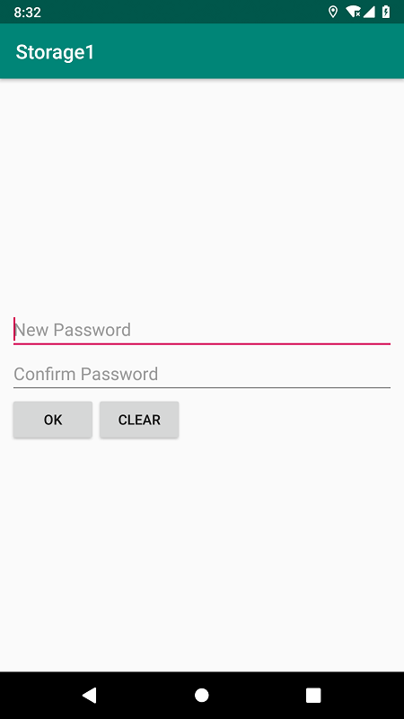
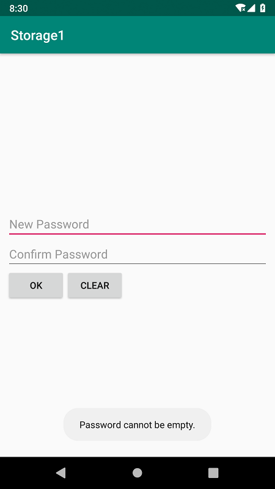
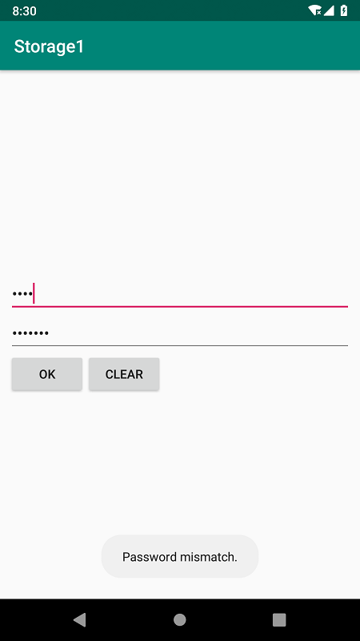
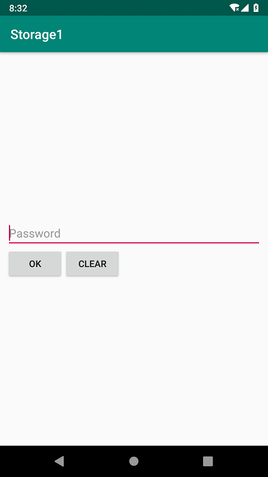
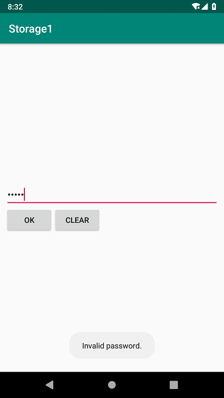
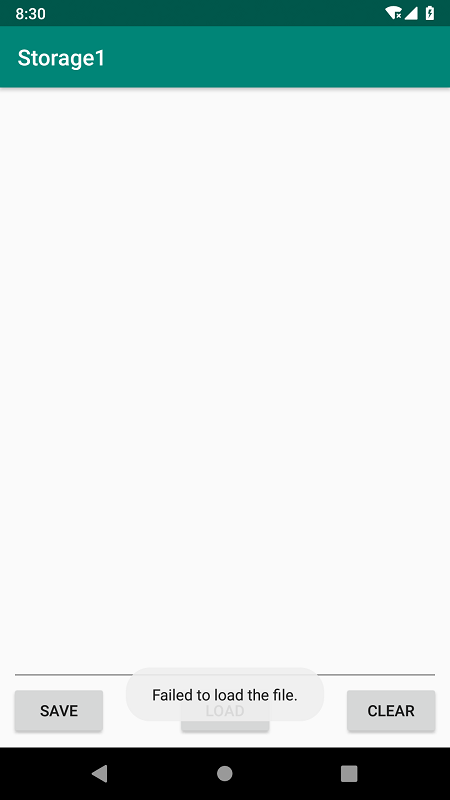

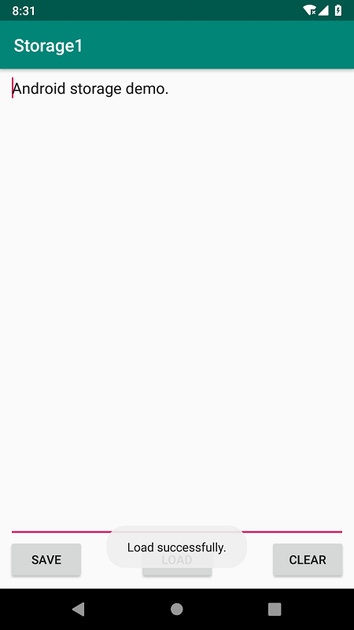

#### (2)实验步骤以及关键代码

* 密码输入
  
  密码输入Activity的布局文件，包含两个输入框和两个按钮：

  ```xml
  <?xml version="1.0" encoding="utf-8"?>
  <android.support.constraint.ConstraintLayout xmlns:android="http://schemas.android.com/apk/res/android"
      xmlns:app="http://schemas.android.com/apk/res-auto"
      xmlns:tools="http://schemas.android.com/tools"
      android:layout_width="match_parent"
      android:layout_height="match_parent"
      tools:context=".PasswordInputActivity">
      <EditText
          android:id="@+id/new_password"
          android:layout_width="match_parent"
          android:layout_height="wrap_content"
          android:hint="@string/new_pass"
          android:inputType="textPassword"
          android:layout_marginLeft="10dp"
          android:layout_marginRight="10dp"
          app:layout_constraintLeft_toLeftOf="parent"
          app:layout_constraintRight_toRightOf="parent"
          app:layout_constraintTop_toTopOf="parent"
          app:layout_constraintBottom_toTopOf="@id/confirm_password"
          app:layout_constraintVertical_chainStyle="packed"/>
      <EditText
          android:id="@+id/confirm_password"
          android:layout_width="match_parent"
          android:layout_height="wrap_content"
          android:hint="@string/conf_pass"
          android:inputType="textPassword"
          android:layout_marginLeft="10dp"
          android:layout_marginRight="10dp"
          app:layout_constraintLeft_toLeftOf="parent"
          app:layout_constraintRight_toRightOf="parent"
          app:layout_constraintTop_toBottomOf="@id/new_password"
          app:layout_constraintBottom_toTopOf="@id/ok_btn" />
      <Button
          android:id="@+id/ok_btn"
          android:layout_width="wrap_content"
          android:layout_height="wrap_content"
          android:layout_marginLeft="10dp"
          android:text="OK"
          app:layout_constraintLeft_toLeftOf="parent"
          app:layout_constraintTop_toBottomOf="@id/confirm_password"
          app:layout_constraintBottom_toBottomOf="parent"/>
      <Button
          android:id="@+id/clr_btn"
          android:layout_width="wrap_content"
          android:layout_height="wrap_content"
          android:text="CLEAR"
          app:layout_constraintTop_toBottomOf="@id/confirm_password"
          app:layout_constraintLeft_toRightOf="@id/ok_btn"/>
  </android.support.constraint.ConstraintLayout>
  ```

  在AndroidManifest中设置noHistory="true"，使得进入文件编辑Activity后，若点击返回按钮，则直接返回Home界面，不再返回密码输入Activity

  ```xml
  <activity
      android:name=".PasswordInputActivity"
      android:noHistory="true">
      <intent-filter>
          <action android:name="android.intent.action.MAIN" />

          <category android:name="android.intent.category.LAUNCHER" />
      </intent-filter>
  </activity>
  ```

  使用SharedPreferences存储密码：

  ```java
  public static int MODE = MODE_PRIVATE;
  public static final String PREFERENCE_NAME = "SavedPassword";
  public static boolean isSaved = false;
  @Override
  protected void onCreate(Bundle savedInstanceState) {
      super.onCreate(savedInstanceState);
      setContentView(R.layout.activity_password_input);

      final EditText newPass = findViewById(R.id.new_password);
      final EditText confirmPass = findViewById(R.id.confirm_password);
      final boolean isSaved;
      Button ok = findViewById(R.id.ok_btn);
      Button clr = findViewById(R.id.clr_btn);
      final SharedPreferences sharedPreferences = getSharedPreferences(PREFERENCE_NAME, MODE);
      final SharedPreferences.Editor editor = sharedPreferences.edit();
  }
  ```

  在onCreate中判断密码是否已存储。若已存储，则修改界面布局。

  ```java
  if (!TextUtils.isEmpty(sharedPreferences.getString("Password", ""))) {
      confirmPass.setVisibility(View.GONE);
      newPass.setHint("Password");
      // 标记已存储
      isSaved = true;
  }
  else {
      // 标记未存储
      isSaved = false;
  }
  ```

  在onCreate中为OK按钮添加监听器，判断密码是否合法，若合法则跳转页面：

  ```java
  ok.setOnClickListener(new View.OnClickListener() {
      @Override
      public void onClick(View v) {
          // 密码为空
          if (TextUtils.isEmpty(newPass.getText().toString())) {
              Toast.makeText(getApplicationContext(), R.string.empty_pass, Toast.LENGTH_SHORT).show();
          }
          // 已保存
          else if (isSaved) {
              // 密码不匹配
              if (!TextUtils.equals(newPass.getText().toString(), sharedPreferences.getString("Password", ""))) {
                  Toast.makeText(getApplicationContext(), R.string.wrong_pass, Toast.LENGTH_SHORT).show();
              }
              // 密码匹配
              else {
                  // 进入文件编辑Activity
                  Intent intent = new Intent(PasswordInputActivity.this, FileEditActivity.class);
                  startActivity(intent);
              }
          }
          // 未保存
          else {
              // 密码不匹配
              if (!TextUtils.equals(newPass.getText().toString(), confirmPass.getText().toString())) {
                  Toast.makeText(getApplicationContext(), R.string.mismatch_pass, Toast.LENGTH_SHORT).show();
              }
              // 密码匹配
              else {
                  // 保存密码
                  editor.putString("Password", newPass.getText().toString());
                  editor.commit();
                  // 进入文件编辑Activity
                  Intent intent = new Intent(PasswordInputActivity.this, FileEditActivity.class);
                  startActivity(intent);
              }
          }

      }
  });
  ```

  在onCreate中为CLEAR按钮添加监听器，清空输入内容：

  ```java
  clr.setOnClickListener(new View.OnClickListener() {
      @Override
      public void onClick(View v) {
          newPass.setText("");
          if (!isSaved)
              confirmPass.setText("");
      }
  });
  ```

* 文件编辑

  文件编辑Activity的布局文件，包含一个输入框和三个按钮：

  ```xml
  <?xml version="1.0" encoding="utf-8"?>
  <android.support.constraint.ConstraintLayout xmlns:android="http://schemas.android.com/apk/res/android"
      xmlns:app="http://schemas.android.com/apk/res-auto"
      xmlns:tools="http://schemas.android.com/tools"
      android:layout_width="match_parent"
      android:layout_height="match_parent"
      tools:context=".FileEditActivity">
      <EditText
          android:id="@+id/file_content"
          android:layout_width="match_parent"
          android:layout_height="0dp"
          android:layout_marginLeft="10dp"
          android:layout_marginRight="10dp"
          android:gravity="top"
          app:layout_constraintTop_toTopOf="parent"
          app:layout_constraintBottom_toTopOf="@id/save_btn"/>
      <Button
          android:id="@+id/save_btn"
          android:layout_width="wrap_content"
          android:layout_height="wrap_content"
          android:layout_marginLeft="10dp"
          android:layout_marginBottom="10dp"
          android:text="SAVE"
          app:layout_constraintTop_toBottomOf="@id/file_content"
          app:layout_constraintBottom_toBottomOf="parent"
          app:layout_constraintLeft_toLeftOf="parent"
          app:layout_constraintRight_toLeftOf="@id/load_btn"
          app:layout_constraintHorizontal_chainStyle="spread_inside"/>
      <Button
          android:id="@+id/load_btn"
          android:layout_width="wrap_content"
          android:layout_height="wrap_content"
          android:layout_marginBottom="10dp"
          android:text="LOAD"
          app:layout_constraintTop_toBottomOf="@id/file_content"
          app:layout_constraintBottom_toBottomOf="parent"
          app:layout_constraintLeft_toRightOf="@id/save_btn"
          app:layout_constraintRight_toLeftOf="@id/clear_btn"/>
      <Button
          android:id="@+id/clear_btn"
          android:layout_width="wrap_content"
          android:layout_height="wrap_content"
          android:layout_marginRight="10dp"
          android:layout_marginBottom="10dp"
          android:text="CLEAR"
          app:layout_constraintTop_toBottomOf="@id/file_content"
          app:layout_constraintBottom_toBottomOf="parent"
          app:layout_constraintLeft_toRightOf="@id/load_btn"
          app:layout_constraintRight_toRightOf="parent"/>
  </android.support.constraint.ConstraintLayout>
  ```

  在onCreate中初始化：

  ```java
  @Override
  protected void onCreate(Bundle savedInstanceState) {
      super.onCreate(savedInstanceState);
      setContentView(R.layout.activity_file_edit);

      final EditText content = findViewById(R.id.file_content);
      Button save = findViewById(R.id.save_btn);
      Button load = findViewById(R.id.load_btn);
      Button clr = findViewById(R.id.clear_btn);
      final String FILE_NAME = "Storage1.txt";
  }
  ```

  在onCreate中为save按钮添加监听器，使用FileOutputStream保存文件：

  ```java
  save.setOnClickListener(new View.OnClickListener() {
      @Override
      public void onClick(View v) {
          try (FileOutputStream fileOutputStream = openFileOutput(FILE_NAME, MODE_PRIVATE)) {
              fileOutputStream.write(content.getText().toString().getBytes());
              Log.i("TAG", "Successfully saved file.");
              Toast.makeText(getApplicationContext(), R.string.save_success, Toast.LENGTH_SHORT).show();
          } catch (IOException ex) {
              Log.e("TAG", "Fail to save file.");
          }
      }
  });
  ```

  在onCreate中为load按钮添加监听器，使用FileInputStream加载文件：

  ```java
  load.setOnClickListener(new View.OnClickListener() {
      @Override
      public void onClick(View v) {
          try (FileInputStream fileInputStream = openFileInput(FILE_NAME)) {
              byte[] contents = new byte[fileInputStream.available()];
              fileInputStream.read(contents);
              content.setText(new String(contents));
              Toast.makeText(getApplicationContext(), R.string.load_success, Toast.LENGTH_SHORT).show();
          } catch (IOException ex) {
              Log.e("TAG", "Fail to read file.");
              Toast.makeText(getApplicationContext(), R.string.load_fail, Toast.LENGTH_SHORT).show();
          }
      }
  });
  ```

  在onCreate中为clear按钮添加监听器，清空输入内容：

  ```java
  clr.setOnClickListener(new View.OnClickListener() {
      @Override
      public void onClick(View v) {
          content.setText("");
      }
  });
  ```

#### (3)实验遇到的困难以及解决思路

* 问题：判断密码是否为空时，使用语句```if (newPass.getText().toString() == "")```不能成功判断。

  解决方法：查询资料后得知，使用```if (TextUtils.isEmpty(newPass.getText().toString()))```能够实现判断是否为空的逻辑。

#### (4)Internal Storage和External Storage的区别

* Internal Storage

  Internal Storage是手机的内部存储空间的一个分区，对于应用是私密的，一般位于/data目录下。Internal Storage主要用来存储数据量较小的信息，如数据库，不能被其他应用访问。

* External Storage
  
  External Storage可以是手机的内部存储空间的一个分区，也可以是sd卡，数据可以是公开的，也可以是私密的。私密数据一般位于storage/emulated/0/Android/data/目录下，不能被其他应用访问。公开数据一般位于/storage/emulated/0目录下，可以被其他应用访问。External Storage主要用来存储数据量较大的信息，如多媒体内容。

### 第十一周任务

#### (1)实验截图
<table>
    <tr>
        <td>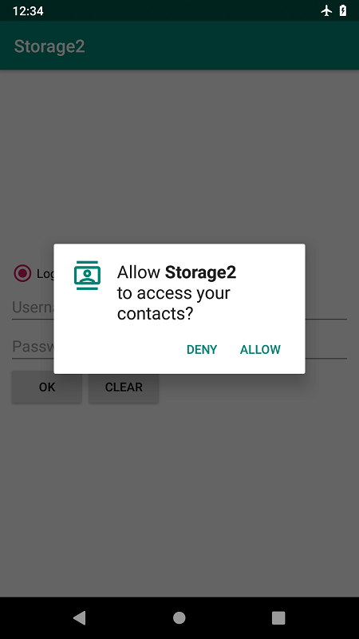<br/>第一次启动应用，请求权限</td>
        <td>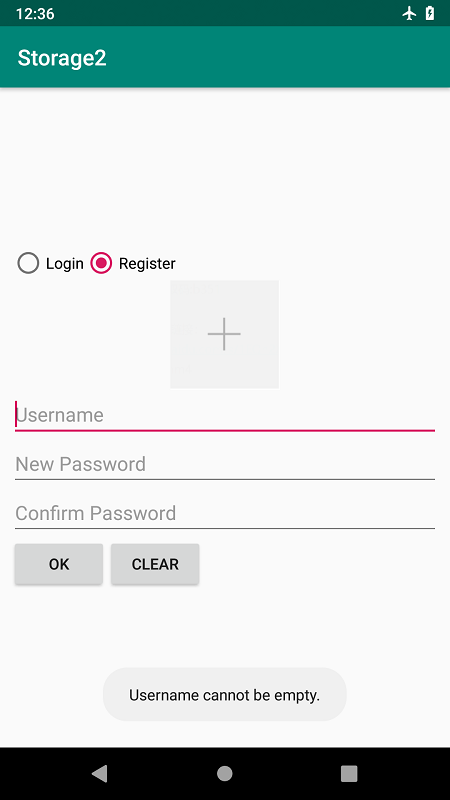<br/>按Register切换到注册界面，用户名为空发出Toast提示</td>
    </tr>
    <tr>
        <td>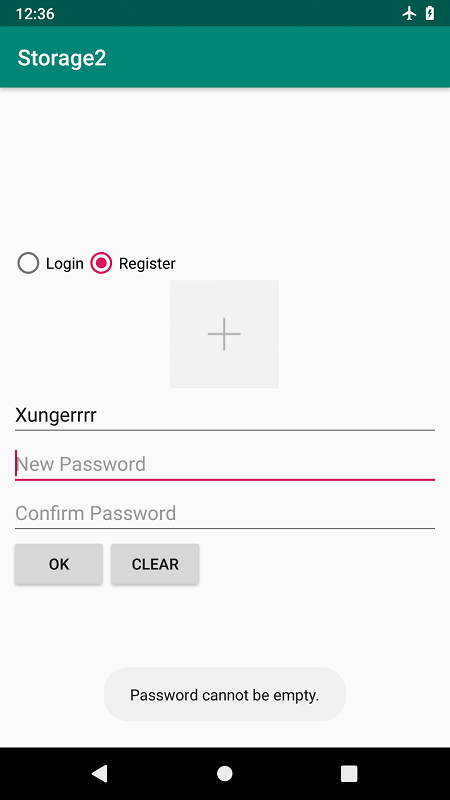<br/>密码为空，发出Toast提示</td>
        <td>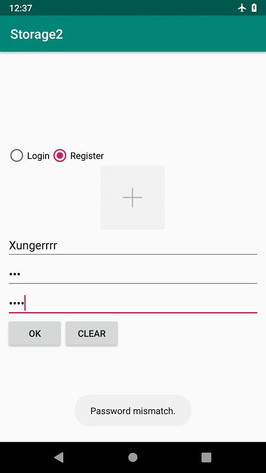<br/>密码不匹配，发出Toast提示</td>
    </tr>
    <tr>
        <td>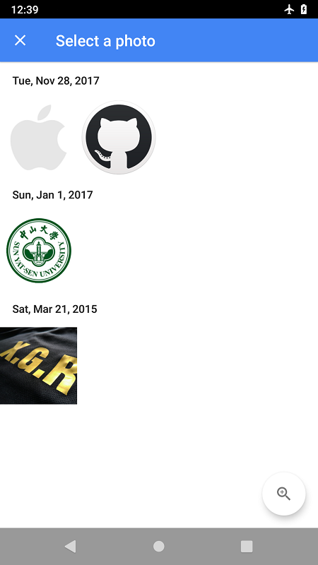<br/>按图片按钮打开手机图库选择照片</td>
        <td>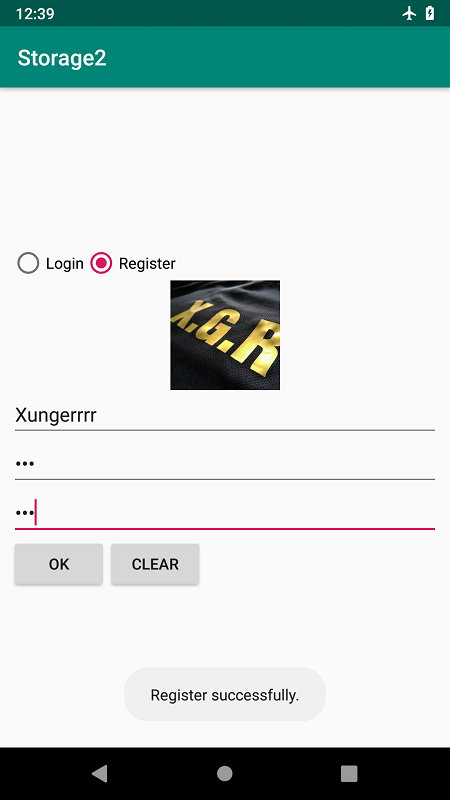<br/>选择好图片，按OK按钮注册成功</td>
    </tr>
    <tr>
        <td>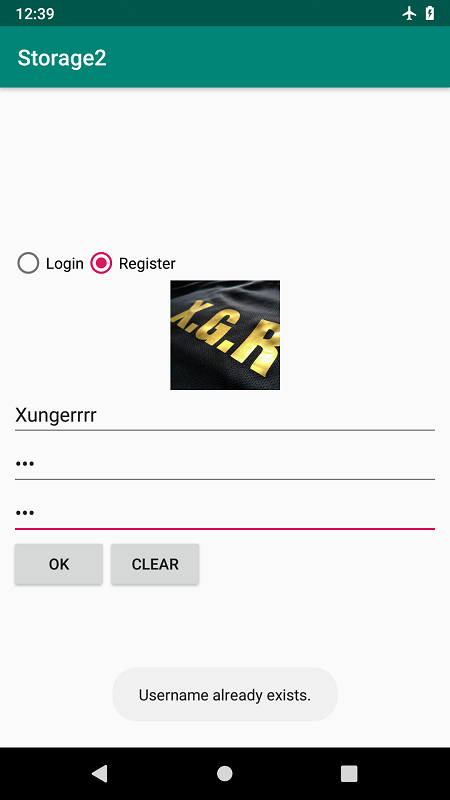<br/>再次注册，则提示用户已存在</td>
        <td>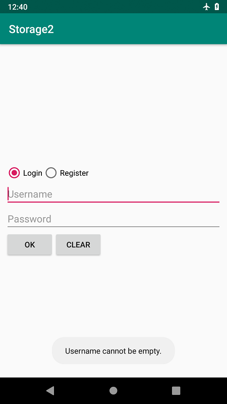<br/>按Login切换到登录界面，用户名为空发出Toast提示</td>
    </tr>
    <tr>
        <td>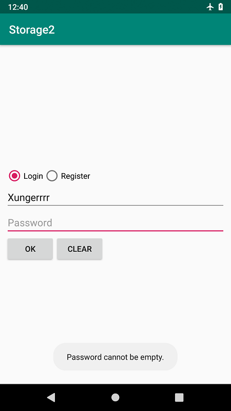<br/>密码为空，发出Toast提示</td>
        <td>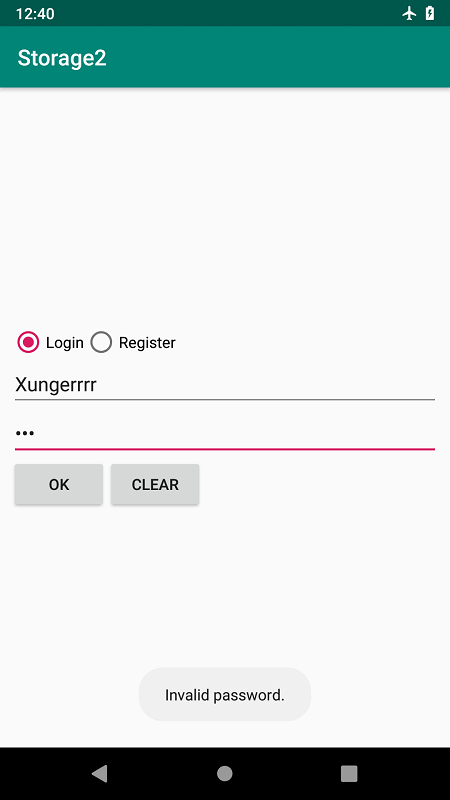<br/>密码不正确，发出Toast提示</td>
    </tr>
    <tr>
        <td>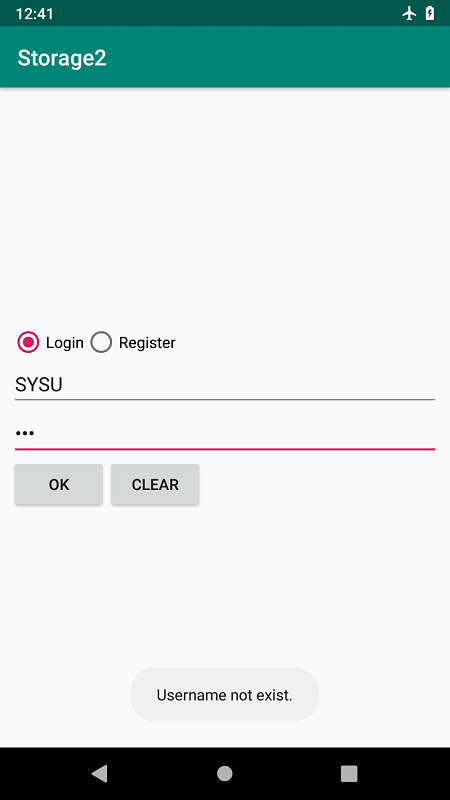<br/>用户不存在，发出Toast提示</td>
        <td>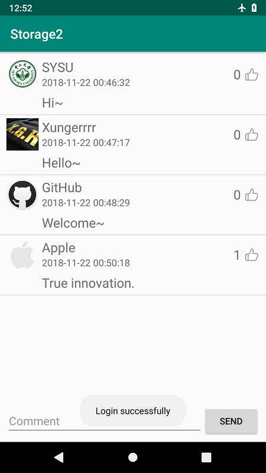<br/>登录成功，切换到评论页面</td>
    </tr>
    <tr>
        <td>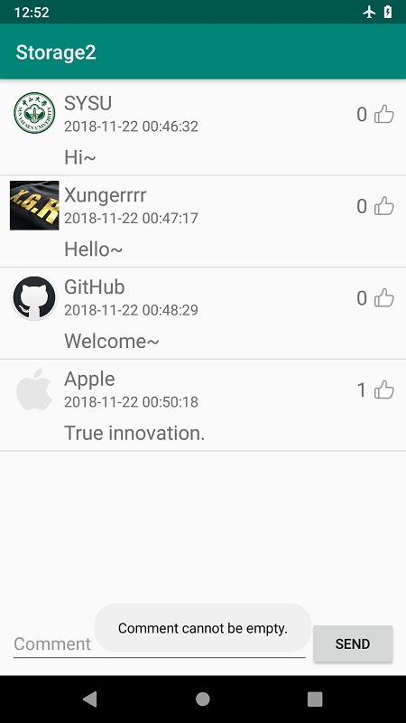<br/>点击SEND，评论为空，发出Toast提示</td>
        <td>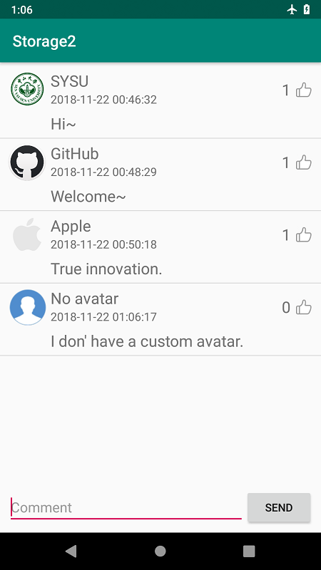<br/>默认头像示例</td>
    </tr>
    <tr>
        <td>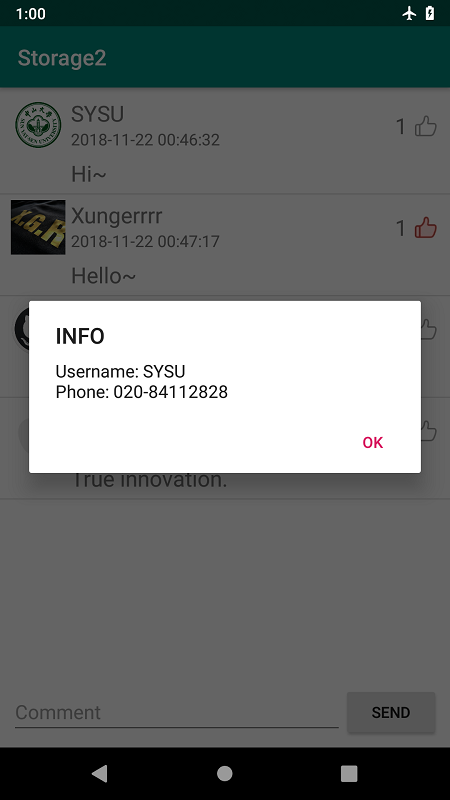<br/>点击查询到电话号码</td>
        <td><br/>点击查询不到电话号码</td>
    </tr>
    <tr>
        <td><br/>举报他人评论</td>
        <td>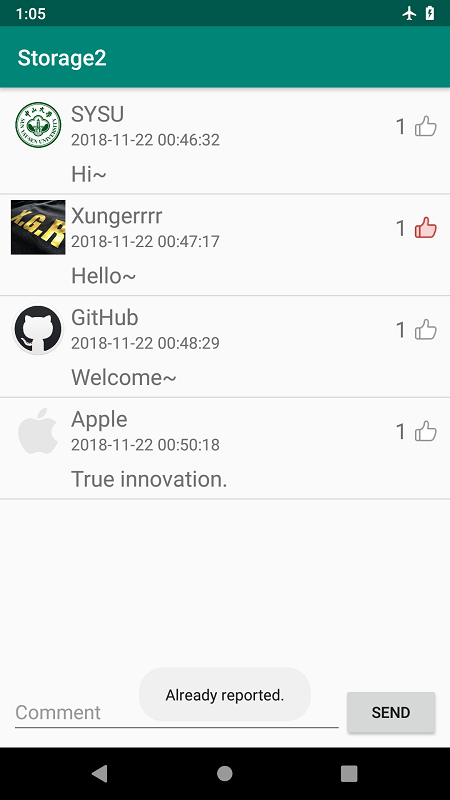<br/>举报成功的Toast信息</td>
    </tr>
    <tr>
        <td>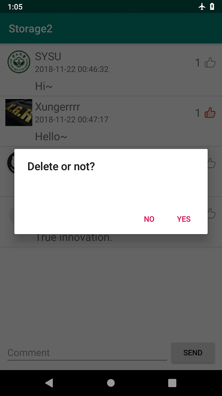<br/>删除自己的评论</td>
        <td>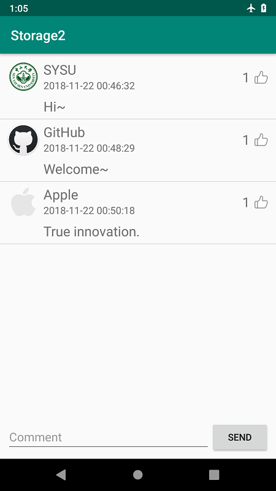<br/>删除成功的Toast信息</td>
    </tr>
</table>

#### (2)实验步骤以及关键代码

* 数据库接口设计

  定义类myDB，封装数据库操作。
  在onCreate中创建三个表，分别记录用户信息、评论信息和点赞信息。

  users表记录了用户的用户名、密码和头像，主码是用户名，头像使用BLOB（Binary Large Object）类型存储；

  comments表记录了评论的id、用户名、时间、内容和点赞数，主码是id；

  likes表记录了用户名及其点赞评论的id，关联了用户和点赞评论，其中用户名和评论id都是外码，对应前两个表的信息。

  具体的SQL语句如下：

  ```java
  public class myDB extends SQLiteOpenHelper {
      private static final String DB_NAME= "storage2.db";
      private static final String TABLE_NAME_1 = "users";
      private static final String TABLE_NAME_2 = "comments";
      private static final String TABLE_NAME_3 = "likes";
      private static final int DB_VERSION = 1;

      public myDB(Context context) {
          super(context, DB_NAME, null, DB_VERSION);
      }
      @Override
      public void onCreate(SQLiteDatabase sqLiteDatabase) {
          String CREATE_TABLE_1 = "CREATE TABLE IF NOT EXISTS "
                  + TABLE_NAME_1
                  + " (name TEXT PRIMARY KEY, password TEXT, avatar BLOB)";
          sqLiteDatabase.execSQL(CREATE_TABLE_1);
          String CREATE_TABLE_2 = "CREATE TABLE IF NOT EXISTS "
                  + TABLE_NAME_2
                  + " (_id INTEGER PRIMARY KEY AUTOINCREMENT, name TEXT, time TEXT, content TEXT, number INTEGER)";
          sqLiteDatabase.execSQL(CREATE_TABLE_2);
          String CREATE_TABLE_3 = "CREATE TABLE IF NOT EXISTS "
                  + TABLE_NAME_3
                  + " (name TEXT, comment INTEGER, PRIMARY KEY (name, comment), FOREIGN KEY (name) REFERENCES "
                  + TABLE_NAME_1 + " (name) ON DELETE CASCADE, FOREIGN KEY(comment) REFERENCES "
                  + TABLE_NAME_2 + " (_id) ON DELETE CASCADE)";
          sqLiteDatabase.execSQL(CREATE_TABLE_3);
      }
      @Override
      public void onUpgrade(SQLiteDatabase sqLiteDatabase, int i, int ii) {}
  }
  ```

  登录时，向数据库查询用户信息并返回结果：

  ```java
  public boolean login(Context context, String name, String password) {
      SQLiteDatabase db = getReadableDatabase();
      String SELECT_USER = "SELECT * FROM "
              + TABLE_NAME_1
              + " WHERE name = ?";
      Cursor cursor = db.rawQuery(SELECT_USER, new String[]{name});
      if (cursor.moveToFirst()) {
          int passwordColumnIndex = cursor.getColumnIndex("password");
          String pass = cursor.getString(passwordColumnIndex);
          if (!TextUtils.equals(pass, password)) {
              // 密码不匹配
              Toast.makeText(context, R.string.password_invalid, Toast.LENGTH_SHORT).show();
              cursor.close();
              return false;
          }
          else {
              // 登录成功
              Toast.makeText(context, "Login successfully", Toast.LENGTH_SHORT).show();
              cursor.close();
              return true;
          }
      }
      else {
          // 用户不存在
          Toast.makeText(context, R.string.no_user, Toast.LENGTH_SHORT).show();
          cursor.close();
          return false;
      }
  }
  ```

  注册时，向数据库查询用户信息并返回结果：

  ```java
  public void register(Context context, String name, String password, byte[] avatar) {
      SQLiteDatabase db = getWritableDatabase();
      String SELECT_USER = "SELECT * FROM "
              + TABLE_NAME_1
              + " WHERE name = ?";
      Cursor cursor = db.rawQuery(SELECT_USER, new String[]{name});
      if (cursor.getCount() != 0) {
          // 用户名已被注册
          Toast.makeText(context, R.string.user_exists, Toast.LENGTH_SHORT).show();
      }
      else {
          // 向数据库中插入新用户信息
          cursor.moveToFirst();
          String INSERT_SQL = "INSERT INTO "
                  + TABLE_NAME_1
                  + " (name, password, avatar) values (?, ?, ?)";
          db.execSQL(INSERT_SQL, new Object[]{name, password, avatar});
          Toast.makeText(context, "Register successfully.", Toast.LENGTH_SHORT).show();
      }
      cursor.close();
  }
  ```

  根据用户名，在数据库中获取头像，返回头像的bitmap文件：

  ```java
  public Bitmap getAvatar(String name) {
      SQLiteDatabase db = getReadableDatabase();
      String SELECT_USER = "SELECT * FROM "
              + TABLE_NAME_1
              + " WHERE name = ?";
      Cursor cursor = db.rawQuery(SELECT_USER, new String[]{name});
      if (cursor.moveToFirst()) {
          byte[] avatar = cursor.getBlob(cursor.getColumnIndex("avatar"));
          Bitmap bmp = BitmapFactory.decodeByteArray(avatar, 0, avatar.length);
          cursor.close();
          return bmp;
      }
      return null;
  }
  ```

  获取全部评论内容，其中包含了点赞数量和点赞状态信息。输入参数为当前登录的用户名，根据该用户名在likes表中查询，以获取评论的点赞状态。

  ```java
  public List<Map<String, Object>> getComments(String name) {
      SQLiteDatabase db = getReadableDatabase();
      String SELECT_COMMENTS = "SELECT * FROM "
              + TABLE_NAME_2;
      Cursor cursor = db.rawQuery(SELECT_COMMENTS, null);
      List<Map<String, Object>> comments = new ArrayList<>();
      if (cursor.moveToFirst()) {
          do {
              // 获取评论信息
              Map<String, Object> comment = new LinkedHashMap<>();
              comment.put("_id", cursor.getInt(cursor.getColumnIndex("_id")));
              comment.put("name", cursor.getString(cursor.getColumnIndex("name")));
              comment.put("time", cursor.getString(cursor.getColumnIndex("time")));
              comment.put("content", cursor.getString(cursor.getColumnIndex("content")));
              comment.put("avatar", getAvatar(comment.get("name").toString()));
              comment.put("number", cursor.getInt(cursor.getColumnIndex("number")));
              // 查询评论是否被用户点赞
              String SELECT_LIKE = "SELECT * FROM "
                      + TABLE_NAME_3
                      + " WHERE name = ? AND comment = ?";
              Cursor c = db.rawQuery(SELECT_LIKE, new String[]{name, comment.get("_id").toString()});
              if (c.moveToFirst()) {
                  comment.put("tag", 1);
              }
              else {
                  comment.put("tag", 0);
              }
              c.close();
              comments.add(comment);
          } while (cursor.moveToNext());
      }
      cursor.close();
      return comments;
  }
  ```

  添加和删除评论：

  ```java
  public int addComment(Map<String, Object> comment) {
      SQLiteDatabase db = getWritableDatabase();
      String name = comment.get("name").toString();
      String time = comment.get("time").toString();
      String content = comment.get("content").toString();
      String INSERT_SQL = "INSERT INTO "
              + TABLE_NAME_2
              + " (name, time, content, number) values (?, ?, ?, ?)";
      db.execSQL(INSERT_SQL, new Object[]{name, time, content, 0});
      String SELECT_COMMENTS = "SELECT * FROM "
              + TABLE_NAME_2;
      // 获取新评论id
      Cursor cursor = db.rawQuery(SELECT_COMMENTS, null);
      cursor.moveToLast();
      return cursor.getInt(cursor.getColumnIndex("_id"));
  }
  public void deleteComment(int _id) {
      SQLiteDatabase db = getWritableDatabase();
      String DELETE_SQL = "DELETE FROM "
              + TABLE_NAME_2
              + " WHERE _id = ?";
      db.execSQL(DELETE_SQL, new Object[]{_id});
  }
  ```

  点赞和取消。点赞或取消时，在likes表中添加或删除点赞记录，在comments表中更新该评论的点赞数量。

  ```java
  public void like(String name, int _id) {
      SQLiteDatabase db = getWritableDatabase();
      // 添加点赞记录
      String INSERT_SQL = "INSERT INTO "
              + TABLE_NAME_3
              + " (name, comment) values (?, ?)";
      db.execSQL(INSERT_SQL, new Object[]{name, _id});
      // 更新评论点赞数
      String UPDATE_SQL = "UPDATE "
              + TABLE_NAME_2
              + " SET number = number + ? WHERE _id = ?";
      db.execSQL(UPDATE_SQL, new Object[]{1, _id});
  }
  public void unlike(String name, int _id) {
      SQLiteDatabase db = getWritableDatabase();
      // 删除点赞记录
      String DELETE_SQL = "DELETE FROM "
              + TABLE_NAME_3
              + " WHERE name = ? AND comment = ?";
      db.execSQL(DELETE_SQL, new Object[]{name, _id});
      // 更新评论点赞数
      String UPDATE_SQL = "UPDATE "
              + TABLE_NAME_2
              + " SET number = number - ? WHERE _id = ?";
      db.execSQL(UPDATE_SQL, new Object[]{1, _id});
  }
  ```

* 注册登录页面
  
  首页Activity的布局文件，包含一个RadioGroup、三个输入框、两个按钮和一个ImageButton：

  ```xml
  <?xml version="1.0" encoding="utf-8"?>
  <android.support.constraint.ConstraintLayout xmlns:android="http://schemas.android.com/apk/res/android"
      xmlns:app="http://schemas.android.com/apk/res-auto"
      xmlns:tools="http://schemas.android.com/tools"
      android:layout_width="match_parent"
      android:layout_height="match_parent"
      tools:context=".MainActivity">
      <RadioGroup
          android:id="@+id/option"
          android:layout_width="match_parent"
          android:layout_height="wrap_content"
          android:orientation="horizontal"
          android:layout_marginLeft="10dp"
          android:layout_marginRight="10dp"
          app:layout_constraintTop_toTopOf="parent"
          app:layout_constraintBottom_toTopOf="@id/avatar"
          app:layout_constraintVertical_chainStyle="packed">
          <RadioButton
              android:id="@+id/login"
              android:layout_width="wrap_content"
              android:layout_height="wrap_content"
              android:checked="true"
              android:text="Login"/>
          <RadioButton
              android:id="@+id/register"
              android:layout_width="wrap_content"
              android:layout_height="wrap_content"
              android:text="Register"/>
      </RadioGroup>
      <ImageButton
          android:visibility="gone"
          android:id="@+id/avatar"
          android:layout_width="100dp"
          android:layout_height="100dp"
          android:background="@mipmap/add"
          android:scaleType="centerCrop"
          app:layout_constraintTop_toBottomOf="@id/option"
          app:layout_constraintBottom_toTopOf="@id/username"
          app:layout_constraintLeft_toLeftOf="parent"
          app:layout_constraintRight_toRightOf="parent"/>
      <EditText
          android:id="@+id/username"
          android:layout_width="match_parent"
          android:layout_height="wrap_content"
          android:layout_marginLeft="10dp"
          android:layout_marginRight="10dp"
          android:hint="Username"
          android:inputType="text"
          app:layout_constraintTop_toBottomOf="@id/avatar"
          app:layout_constraintBottom_toTopOf="@id/password"/>
      <EditText
          android:id="@+id/password"
          android:layout_width="match_parent"
          android:layout_height="wrap_content"
          android:layout_marginLeft="10dp"
          android:layout_marginRight="10dp"
          android:hint="Password"
          android:inputType="textPassword"
          app:layout_constraintTop_toBottomOf="@id/username"
          app:layout_constraintBottom_toTopOf="@id/confirm_password"/>
      <EditText
          android:visibility="gone"
          android:id="@+id/confirm_password"
          android:layout_width="match_parent"
          android:layout_height="wrap_content"
          android:layout_marginLeft="10dp"
          android:layout_marginRight="10dp"
          android:hint="Confirm Password"
          android:inputType="textPassword"
          app:layout_constraintTop_toBottomOf="@id/password"
          app:layout_constraintBottom_toTopOf="@id/ok"/>
      <Button
          android:id="@+id/ok"
          android:layout_width="wrap_content"
          android:layout_height="wrap_content"
          android:layout_marginLeft="10dp"
          android:layout_marginRight="10dp"
          android:text="OK"
          app:layout_constraintTop_toBottomOf="@id/confirm_password"
          app:layout_constraintBottom_toBottomOf="parent"
          app:layout_constraintLeft_toLeftOf="parent"/>
      <Button
          android:id="@+id/clear"
          android:layout_width="wrap_content"
          android:layout_height="wrap_content"
          android:text="CLEAR"
          app:layout_constraintTop_toBottomOf="@id/confirm_password"
          app:layout_constraintLeft_toRightOf="@id/ok" />
  </android.support.constraint.ConstraintLayout>
  ```

  MainActivity类中的变量：

  ```java
  private myDB db; // 数据库操作对象
  private byte[] img; // 头像图片的二进制数据
  ```

  变量初始化：

  ```java
  db = new myDB(getApplicationContext());
  ByteArrayOutputStream baos = new ByteArrayOutputStream();
  Bitmap bmp = ((BitmapDrawable)getResources().getDrawable(R.mipmap.me)).getBitmap();
  bmp.compress(Bitmap.CompressFormat.PNG, 100, baos);
  img = baos.toByteArray();
  ```

  注册和登录的切换：

  ```java
  RadioGroup options = findViewById(R.id.option);
  options.setOnCheckedChangeListener(new RadioGroup.OnCheckedChangeListener() {
      @Override
      public void onCheckedChanged(RadioGroup group, int checkedId) {
          if (checkedId == R.id.login) {
              avatar.setVisibility(View.GONE);
              confirm.setVisibility(View.GONE);
              password.setHint("Password");
              password.setText("");
              confirm.setText("");
          }
          else if (checkedId == R.id.register) {
              avatar.setVisibility(View.VISIBLE);
              confirm.setVisibility(View.VISIBLE);
              password.setHint("New Password");
              password.setText("");
              confirm.setText("");
          }
      }
  });
  ```

  在onCreate中为OK按钮添加监听器，实现注册和登录的逻辑。注册时，直接调用myDB.register，传入头像的二进制数据，实现在数据库中保存图像。

  ```java
  Button ok = findViewById(R.id.ok);
  ok.setOnClickListener(new View.OnClickListener() {
      @Override
      public void onClick(View v) {
          if (TextUtils.isEmpty(username.getText().toString())) {
              // 用户名为空
              Toast.makeText(getApplicationContext(), R.string.empty_name, Toast.LENGTH_SHORT).show();
          }
          else if (TextUtils.isEmpty(password.getText().toString())) {
              // 密码为空
              Toast.makeText(getApplicationContext(), R.string.empty_password, Toast.LENGTH_SHORT).show();
          }
          else if (!TextUtils.equals(password.getText().toString(), confirm.getText().toString()) &&
                  confirm.getVisibility() == View.VISIBLE) {
              // 前后密码不匹配
              Toast.makeText(getApplicationContext(), R.string.password_mismatch, Toast.LENGTH_SHORT).show();
          }
          else if (confirm.getVisibility() == View.GONE) {
              // 若在登录界面
              if (db.login(getApplicationContext(), username.getText().toString(), password.getText().toString())) {
                  // 登录成功，跳转到评论页面
                  Intent intent = new Intent(MainActivity.this, CommentActivity.class);
                  Bundle bundle = new Bundle();
                  bundle.putString("name", username.getText().toString());
                  intent.putExtras(bundle);
                  password.setText("");
                  startActivity(intent);
              }
          }
          else {
              // 注册用户
              db.register(getApplicationContext(), username.getText().toString(), password.getText().toString(), img);
          }
      }
  });
  ```

  在onCreate中为CLEAR按钮添加监听器，实现清空输入：

  ```java
  Button clr = findViewById(R.id.clear);
  clr.setOnClickListener(new View.OnClickListener() {
      @Override
      public void onClick(View v) {
          username.setText("");
          password.setText("");
          confirm.setText("");
      }
  });
  ```

  在onCreate中为ImageButton按钮添加监听器，调用系统图库，选择图片。在onActivityResult中获取图片，转换为二进制数据：

  ```java
  final ImageButton avatar = findViewById(R.id.avatar);
  avatar.setOnClickListener(new View.OnClickListener() {
      @Override
      public void onClick(View v) {
          Intent intent = new Intent();
          intent.setAction(Intent.ACTION_PICK);
          intent.setType("image/*");
          startActivityForResult(intent, 0);
      }
  });
  ```
  ```java
  @Override
  protected void onActivityResult(int requestCode, int resultCode, Intent data) {
      if (data != null && requestCode == 0) {
          Uri uri = data.getData();
          ImageButton avatar = findViewById(R.id.avatar);
          avatar.setImageURI(uri);
          // 获取图像的bitmap
          ByteArrayOutputStream baos = new ByteArrayOutputStream();
          Bitmap bmp = ((BitmapDrawable)avatar.getDrawable()).getBitmap();
          bmp.compress(Bitmap.CompressFormat.PNG, 100, baos);
          img = baos.toByteArray();
      }
      super.onActivityResult(requestCode, resultCode, data);
  }
  ```

* 评论页面

  评论Activity的布局文件，包含一个ListView、一个输入框和一个按钮：

  ```xml
  <?xml version="1.0" encoding="utf-8"?>
  <android.support.constraint.ConstraintLayout xmlns:android="http://schemas.android.com/apk/res/android"
      xmlns:app="http://schemas.android.com/apk/res-auto"
      xmlns:tools="http://schemas.android.com/tools"
      android:layout_width="match_parent"
      android:layout_height="match_parent"
      tools:context=".CommentActivity">
      <ListView
          android:id="@+id/comments"
          android:layout_width="match_parent"
          android:layout_height="0dp"
          android:layout_marginBottom="10dp"
          app:layout_constraintTop_toTopOf="parent"
          app:layout_constraintBottom_toTopOf="@id/comment_input">
      </ListView>
      <EditText
          android:id="@+id/comment_input"
          android:layout_width="0dp"
          android:layout_height="wrap_content"
          android:layout_marginLeft="10dp"
          android:layout_marginBottom="10dp"
          android:hint="Comment"
          app:layout_constraintBottom_toBottomOf="parent"
          app:layout_constraintLeft_toLeftOf="parent"
          app:layout_constraintRight_toLeftOf="@id/send"
          app:layout_constraintTop_toBottomOf="@id/comments" />
      <Button
          android:id="@+id/send"
          android:layout_width="wrap_content"
          android:layout_height="wrap_content"
          android:layout_marginRight="10dp"
          android:text="SEND"
          app:layout_constraintTop_toTopOf="@id/comment_input"
          app:layout_constraintBottom_toBottomOf="@id/comment_input"
          app:layout_constraintLeft_toRightOf="@id/comment_input"
          app:layout_constraintRight_toRightOf="parent"/>
  </android.support.constraint.ConstraintLayout>
  ```

  ListView中Item的布局文件如下，表示一条评论：

  ```xml
  <?xml version="1.0" encoding="utf-8"?>
  <android.support.constraint.ConstraintLayout xmlns:android="http://schemas.android.com/apk/res/android"
      xmlns:tools="http://schemas.android.com/tools"
      android:layout_width="match_parent"
      android:layout_height="wrap_content"
      xmlns:app="http://schemas.android.com/apk/res-auto">
      <ImageView
          android:id="@+id/comment_avatar"
          android:layout_width="50dp"
          android:layout_height="50dp"
          android:layout_marginLeft="10dp"
          android:layout_marginTop="10dp"
          android:src="@mipmap/me"
          android:scaleType="centerCrop"
          app:layout_constraintLeft_toLeftOf="parent"
          app:layout_constraintTop_toTopOf="parent"/>
      <TextView
          android:id="@+id/comment_name"
          android:layout_width="wrap_content"
          android:layout_height="wrap_content"
          android:layout_marginLeft="10dp"
          android:textSize="20dp"
          android:text="Name"
          app:layout_constraintLeft_toRightOf="@id/comment_avatar"
          app:layout_constraintTop_toTopOf="@id/comment_avatar"/>
      <TextView
          android:id="@+id/time"
          android:layout_width="wrap_content"
          android:layout_height="wrap_content"
          android:layout_marginLeft="10dp"
          android:textSize="15dp"
          android:text="time"
          app:layout_constraintLeft_toRightOf="@id/comment_avatar"
          app:layout_constraintBottom_toBottomOf="@id/comment_avatar"/>
      <TextView
          android:id="@+id/content"
          android:layout_width="0dp"
          android:layout_height="26dp"
          android:layout_marginLeft="10dp"
          android:layout_marginTop="5dp"
          android:layout_marginRight="10dp"
          android:layout_marginBottom="10dp"
          android:textSize="20dp"
          app:layout_constraintLeft_toRightOf="@id/comment_avatar"
          app:layout_constraintRight_toRightOf="parent"
          app:layout_constraintTop_toBottomOf="@id/time"
          app:layout_constraintBottom_toBottomOf="parent"/>
      <TextView
          android:id="@+id/number_of_likes"
          android:layout_width="wrap_content"
          android:layout_height="wrap_content"
          android:layout_marginRight="5dp"
          android:textSize="20dp"
          android:text="0"
          app:layout_constraintRight_toLeftOf="@id/like"
          app:layout_constraintTop_toTopOf="@id/comment_avatar"
          app:layout_constraintBottom_toBottomOf="@id/comment_avatar"/>
      <ImageView
          android:id="@+id/like"
          android:layout_width="24dp"
          android:layout_height="24dp"
          android:layout_marginRight="10dp"
          android:background="@mipmap/white"
          android:scaleType="fitCenter"
          app:layout_constraintRight_toRightOf="parent"
          app:layout_constraintTop_toTopOf="@id/comment_avatar"
          app:layout_constraintBottom_toBottomOf="@id/comment_avatar"/>
  </android.support.constraint.ConstraintLayout>
  ```

  ListView的适配器。使用List记录评论内容。其中，在getView函数中为点赞按钮添加点击事件监听器，通过调用myDB.like和myDB.unlike，实现点赞和取消赞的操作。

  ```java
  public class MyAdapter extends BaseAdapter {
      private Context context;
      private List<Map<String, Object>> data;
      private myDB db;
      private String name;

      public MyAdapter(Context _context, List<Map<String, Object>> list, String _name) {
          context = _context;
          data = list;
          db = new myDB(_context);
          name = _name;
      }
      @Override
      public View getView(int i, View view, ViewGroup viewGroup) {
          // 新声明一个View变量和ViewHolder变量,ViewHolder类在下面定义。
          View convertView;
          final ViewHolder viewHolder;
          // 当view为空时才加载布局，否则，直接修改内容
          if (view == null) {
              // 通过inflate的方法加载布局，context需要在使用这个Adapter的Activity中传入。
              convertView= LayoutInflater.from(context).inflate(R.layout.item, null);
              viewHolder = new ViewHolder();
              viewHolder.avatar = convertView.findViewById(R.id.comment_avatar);
              viewHolder.name = convertView.findViewById(R.id.comment_name);
              viewHolder.time = convertView.findViewById(R.id.time);
              viewHolder.content = convertView.findViewById(R.id.content);
              viewHolder.num = convertView.findViewById(R.id.number_of_likes);
              viewHolder.like = convertView.findViewById(R.id.like);
              convertView.setTag(viewHolder); // 用setTag方法将处理好的viewHolder放入view中
          } else { // 否则，让convertView等于view，然后从中取出ViewHolder即可
              convertView = view;
              viewHolder = (ViewHolder) convertView.getTag();
          }
          // 从viewHolder中取出对应的对象，然后赋值给他们
          final int _id = (int)data.get(i).get("_id");
          final int tag = (int)data.get(i).get("tag");
          BitmapDrawable bitmapDrawable = new BitmapDrawable((Bitmap)data.get(i).get("avatar"));
          viewHolder.avatar.setImageDrawable(bitmapDrawable);
          viewHolder.name.setText(data.get(i).get("name").toString());
          viewHolder.time.setText(data.get(i).get("time").toString());
          viewHolder.content.setText(data.get(i).get("content").toString());
          viewHolder.num.setText(data.get(i).get("number").toString());
          if (tag == 0) {
              viewHolder.like.setBackgroundResource(R.mipmap.white);
          }
          else {
              viewHolder.like.setBackgroundResource(R.mipmap.red);
          }
          viewHolder.like.setTag(tag);
          // 实现点赞按钮的点击事件处理
          viewHolder.like.setOnClickListener(new View.OnClickListener() {
              @Override
              public void onClick(View v) {
                  if ((int)v.getTag() == 0) {
                      v.setBackgroundResource(R.mipmap.red);
                      v.setTag(1);
                      int num = Integer.parseInt(viewHolder.num.getText().toString()) + 1;
                      viewHolder.num.setText(Integer.toString(num));
                      // 数据库操作
                      db.like(name, _id);
                  }
                  else {
                      v.setBackgroundResource(R.mipmap.white);
                      v.setTag(0);
                      int num = Integer.parseInt(viewHolder.num.getText().toString()) - 1;
                      viewHolder.num.setText(Integer.toString(num));
                      // 数据库操作
                      db.unlike(name, _id);
                  }
              }
          });
          // 将这个处理好的view返回
          return convertView;
      }

      private class ViewHolder {
          public ImageView avatar;
          public TextView name;
          public TextView time;
          public TextView content;
          public TextView num;
          public ImageView like;
      }
  }
  ```

  在intent中取得登录用户名：

  ```java
  Intent intent = getIntent();
  Bundle bundle = intent.getExtras();
  final String name = bundle.getString("name");
  ```

  根据用户名，从数据库中获取评论，并创建Adapter，显示评论：

  ```java
  db = new myDB(getApplicationContext());
  ListView comments = findViewById(R.id.comments);
  final List<Map<String, Object>> data = db.getComments(name);
  final MyAdapter myAdapter = new MyAdapter(this, data, name);
  comments.setAdapter(myAdapter);
  ```

  为SEND按钮添加监听器，实现评论逻辑：

  ```java
  Button send = findViewById(R.id.send);
  send.setOnClickListener(new View.OnClickListener() {
      @Override
      public void onClick(View v) {
          if (TextUtils.isEmpty(input.getText().toString())) {
              // 评论为空
              Toast.makeText(getApplicationContext(), R.string.empty_comment, Toast.LENGTH_SHORT).show();
          }
          else {
              // 发送评论
              Date date = Calendar.getInstance().getTime();
              android.text.format.DateFormat dateFormat = new android.text.format.DateFormat();
              String time = dateFormat.format("yyyy-MM-dd HH:mm:ss", date).toString();
              Map<String, Object> comment = new LinkedHashMap<>();
              comment.put("name", name);
              comment.put("time", time);
              comment.put("content", input.getText().toString());
              comment.put("_id", db.addComment(comment)); // 向数据库添加评论，获取评论的id
              comment.put("avatar", db.getAvatar(name));  // 获取用户的头像
              comment.put("number", 0);                   // 初始点赞数为0
              comment.put("tag", 0);                      // 初始状态是未被用户评论
              data.add(comment);
              myAdapter.notifyDataSetChanged();
              input.setText("");
          }
      }
  });
  ```

  为ListView添加点击监听器，实现删除评论和举报评论：

  ```java
  final EditText input = findViewById(R.id.comment_input);
  final AlertDialog.Builder alertDialog = new AlertDialog.Builder(this);
  // 点击评论
  comments.setOnItemClickListener(new AdapterView.OnItemClickListener() {
      @Override
      public void onItemClick(AdapterView<?> parent, View view, int position, long id) {
          String name = data.get(position).get("name").toString();
          // 使用Content Provider查询电话号码
          Cursor cursor = getContentResolver().query(
                  ContactsContract.CommonDataKinds.Phone.CONTENT_URI,null,
                  ContactsContract.CommonDataKinds.Phone.DISPLAY_NAME + " = \"" + name + "\"",
                  null, null);
          String number;
          if(cursor.moveToFirst()) {
              // 至少有一个号码
              number = "\nPhone: ";
              do {
                  number += cursor.getString(cursor.getColumnIndex(ContactsContract.CommonDataKinds.Phone.NUMBER)) + "         ";
              } while (cursor.moveToNext());
          }
          else {
              // 没有号码
              number = "\nPhone number not exist.";
          }
          alertDialog.setTitle("INFO").setPositiveButton("OK", null).setMessage(
                  "Username: " + name + number).create().show();
      }
  });
  // 长按评论
  comments.setOnItemLongClickListener(new AdapterView.OnItemLongClickListener() {
      @Override
      public boolean onItemLongClick(AdapterView<?> parent, View view, final int position, long id) {
          TextView comment_name = view.findViewById(R.id.comment_name);
          if (TextUtils.equals(comment_name.getText().toString(), name)) {
              // 如果是自己发的评论，则实现删除
              alertDialog.setPositiveButton("YES", new DialogInterface.OnClickListener() {
                  @Override
                  public void onClick(DialogInterface dialog, int which) {
                      int _id = (int)data.get(position).get("_id");
                      db.deleteComment(_id);
                      data.remove(position);
                      myAdapter.notifyDataSetChanged();
                  }
              }).setNegativeButton("NO", null).setTitle(
                      "Delete or not?").setMessage("").create().show();
          }
          else {
              // 如果是别人发的评论，则实现举报
              alertDialog.setPositiveButton("YES", new DialogInterface.OnClickListener() {
                  @Override
                  public void onClick(DialogInterface dialog, int which) {
                      Toast.makeText(getApplicationContext(), R.string.report_msg, Toast.LENGTH_SHORT).show();
                  }
              }).setNegativeButton("NO", null).setTitle(
                      "Report or not?").setMessage("").create().show();
          }
          return true;
      }
  });
  ```

#### (3)实验遇到的困难以及解决思路

* 问题：创建评论后立刻点击或长按，程序停止运行。

  解决方法：问题产生的原因是，在创建评论后，没有返回评论在数据库中的id，导致点击或长按时，获取评论id为null。为新评论设置了返回的id后，成功解决问题。

---

## 四、实验思考及感想
  在本次实验中，我使用了SharedPreference、文件、SQLite数据库和Content Provider实现了安卓数据存储和访问。

  在实验中，我学到了许多有趣并且有用的知识，例如SharedPreference、Java文件IO、数据库的使用和Content Provider等等，对安卓应用的存储类型和存储方式有了初步了解。通过复杂的编程实验训练，我对安卓应用的调试方法更加熟悉，代码出错的次数明显减少，程序的结构也更加规范和完善。