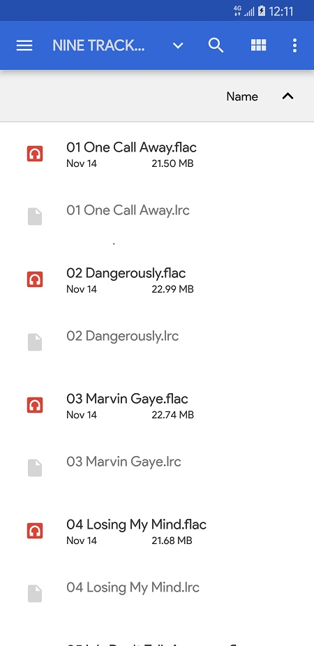

## 一、实验题目
## 简单音乐播放器

---

## 二、实现内容

实现一个简单的播放器，要求功能有：  
<table>
    <tr>
        <td >打开程序主页面</td>
        <td >开始播放</td>
    </tr>
    <tr>
        <td >暂停</td>
        <td >停止</td>
    </tr>
</table>

1. 播放、暂停、停止、退出功能，按停止键会重置封面转角，进度条和播放按钮；按退出键将停止播放并退出程序
2. 后台播放功能，按手机的返回键和home键都不会停止播放，而是转入后台进行播放
3. 进度条显示播放进度、拖动进度条改变进度功能
4. 播放时图片旋转，显示当前播放时间功能，圆形图片的实现使用的是一个开源控件CircleImageView
5. 在保持上述原有的功能的情况下，使用rxJava代替Handler进行UI的更新。

**附加内容（加分项，加分项每项占10分）**

1.选歌

用户可以点击选歌按钮自己选择歌曲进行播放，要求换歌后不仅能正常实现上述的全部功能，还要求选歌成功后不自动播放，重置播放按钮，重置进度条，重置歌曲封面转动角度，最重要的一点：需要解析mp3文件，并更新封面图片。

---

## 三、实验结果

### (1)实验截图

* 打开程序主页面

  

* 开始播放

  

* 暂停

  

* 停止

  

* 点击选歌按钮选歌

  

* 选歌后

  

* 选歌后开始播放

  

* 选歌后暂停

  

### (2)实验步骤以及关键代码

* 程序主页面的布局由CircleImageView、TextView、SeekBar由ImageButton组成。布局代码如下：

  ```xml
  <?xml version="1.0" encoding="utf-8"?>
  <android.support.constraint.ConstraintLayout xmlns:android="http://schemas.android.com/apk/res/android"
      xmlns:app="http://schemas.android.com/apk/res-auto"
      xmlns:tools="http://schemas.android.com/tools"
      android:layout_width="match_parent"
      android:layout_height="match_parent"
      tools:context=".MainActivity">

      <de.hdodenhof.circleimageview.CircleImageView
          xmlns:app="http://schemas.android.com/apk/res-auto"
          android:id="@+id/album_art"
          android:layout_width="250dp"
          android:layout_height="250dp"
          android:layout_marginTop="80dp"
          android:src="@drawable/img"
          app:layout_constraintLeft_toLeftOf="parent"
          app:layout_constraintRight_toRightOf="parent"
          app:layout_constraintTop_toTopOf="parent"/>

      <TextView
          android:id="@+id/title"
          android:layout_width="wrap_content"
          android:layout_height="wrap_content"
          android:layout_marginTop="20dp"
          android:textSize="20sp"
          android:textColor="#000000"
          android:text="山高水长"
          app:layout_constraintLeft_toLeftOf="parent"
          app:layout_constraintRight_toRightOf="parent"
          app:layout_constraintTop_toBottomOf="@id/album_art" />
      <TextView
          android:id="@+id/artist"
          android:layout_width="wrap_content"
          android:layout_height="wrap_content"
          android:layout_marginTop="10dp"
          android:text="中山大学合唱团"
          app:layout_constraintLeft_toLeftOf="parent"
          app:layout_constraintRight_toRightOf="parent"
          app:layout_constraintTop_toBottomOf="@id/title"/>
      <SeekBar
          android:id="@+id/seek_bar"
          android:layout_width="0dp"
          android:layout_height="wrap_content"
          android:layout_marginLeft="60dp"
          android:layout_marginRight="60dp"
          app:layout_constraintTop_toTopOf="@id/current_time"
          app:layout_constraintBottom_toBottomOf="@id/current_time"
          app:layout_constraintLeft_toLeftOf="parent"
          app:layout_constraintRight_toRightOf="parent"/>
      <TextView
          android:id="@+id/current_time"
          android:layout_width="wrap_content"
          android:layout_height="wrap_content"
          android:layout_marginLeft="20dp"
          android:layout_marginBottom="50dp"
          android:text="00:00"
          app:layout_constraintLeft_toLeftOf="parent"
          app:layout_constraintBottom_toTopOf="@id/play"/>
      <TextView
          android:id="@+id/total_time"
          android:layout_width="wrap_content"
          android:layout_height="wrap_content"
          android:layout_marginRight="20dp"
          android:text="00:00"
          app:layout_constraintBottom_toBottomOf="@id/current_time"
          app:layout_constraintRight_toRightOf="parent"/>
      <ImageButton
          android:id="@+id/file"
          android:layout_width="40dp"
          android:layout_height="40dp"
          android:layout_marginLeft="20dp"
          android:background="@android:color/transparent"
          android:src="@drawable/file"
          android:scaleType="centerCrop"
          app:layout_constraintLeft_toLeftOf="parent"
          app:layout_constraintTop_toTopOf="@id/play"
          app:layout_constraintBottom_toBottomOf="@id/play"/>
      <de.hdodenhof.circleimageview.CircleImageView
          xmlns:app="http://schemas.android.com/apk/res-auto"
          android:id="@+id/play"
          android:layout_width="50dp"
          android:layout_height="50dp"
          android:layout_marginBottom="80dp"
          android:layout_marginRight="20dp"
          android:src="@drawable/play"
          app:layout_constraintLeft_toLeftOf="parent"
          app:layout_constraintRight_toLeftOf="@id/stop"
          app:layout_constraintBottom_toBottomOf="parent"
          app:layout_constraintHorizontal_chainStyle="packed"/>
      <de.hdodenhof.circleimageview.CircleImageView
          xmlns:app="http://schemas.android.com/apk/res-auto"
          android:id="@+id/stop"
          android:layout_width="50dp"
          android:layout_height="50dp"
          android:layout_marginBottom="80dp"
          android:src="@drawable/stop"
          app:layout_constraintLeft_toRightOf="@id/play"
          app:layout_constraintRight_toRightOf="parent"
          app:layout_constraintBottom_toBottomOf="parent"/>
      <ImageButton
          android:id="@+id/quit"
          android:layout_width="40dp"
          android:layout_height="40dp"
          android:layout_marginRight="20dp"
          android:background="@android:color/transparent"
          android:src="@drawable/back"
          android:scaleType="centerCrop"
          app:layout_constraintRight_toRightOf="parent"
          app:layout_constraintTop_toTopOf="@id/stop"
          app:layout_constraintBottom_toBottomOf="@id/stop"/>
  </android.support.constraint.ConstraintLayout>
  ```

* MusicService类的创建，实现MediaPlayer的功能：

  ```java
  public class MusicService extends Service {
      public final IBinder binder = new MyBinder();
      public MediaPlayer mediaPlayer = new MediaPlayer();
      private final int STOP_CODE = 0;
      private final int  PLAY_CODE = 1;
      private final int GET_POSITION_CODE = 2;
      private final int LOAD_CODE = 3;
      private final int SEEK_TO_CODE = 4;
      private final int GET_DURATION_CODE = 5;

      public MusicService() {}

      @Override
      public IBinder onBind(Intent intent) {
          try {
              mediaPlayer.setDataSource(Environment.getExternalStorageDirectory() + "/data/山高水长.mp3");
              mediaPlayer.prepare();
          } catch (IOException e) {
              e.printStackTrace();
          }
          return binder;
      }

      public class MyBinder extends Binder {
          @Override
          protected boolean onTransact(int code, @NonNull Parcel data, @Nullable Parcel reply, int flags) throws RemoteException {
              switch (code) {
                  case PLAY_CODE: // 播放和暂停
                      if (mediaPlayer.isPlaying()) {
                          mediaPlayer.pause();
                      } else {
                          mediaPlayer.start();
                      }
                      break;
                  case STOP_CODE: // 停止
                      if (mediaPlayer != null) {
                          mediaPlayer.stop();
                          try {
                              mediaPlayer.prepare();
                              mediaPlayer.seekTo(0);
                          } catch (Exception e) {
                              e.printStackTrace();
                          }
                      }
                      break;
                  case GET_POSITION_CODE: // 获取当前播放进度
                      reply.writeInt(mediaPlayer.getCurrentPosition());
                      break;
                  case LOAD_CODE: // 选歌
                      Uri uri = Uri.parse(data.readString());
                      if (mediaPlayer != null) {
                          mediaPlayer.stop();
                          mediaPlayer.reset();
                          mediaPlayer.setAudioStreamType(AudioManager.STREAM_MUSIC);
                          try {
                              mediaPlayer.setDataSource(getApplicationContext(), uri);
                              mediaPlayer.prepare();
                              mediaPlayer.seekTo(0);
                              reply.writeInt(mediaPlayer.getDuration());
                          }
                          catch(IOException s) {
                              Log.e("TAG", "Failed to open the audio file.");
                          }
                      }
                      break;
                  case SEEK_TO_CODE:  // 改变进度
                      mediaPlayer.seekTo(data.readInt());
                      break;
                  case GET_DURATION_CODE: // 获取音乐时长
                      reply.writeInt(mediaPlayer.getDuration());
                      break;
              }
              return super.onTransact(code, data, reply, flags);
          }
      }
  }
  ```

* 在MainActivity中，绑定Service，并设置控件初始值：

  ```java
  serviceConnection = new ServiceConnection() {
      @Override
      public void onServiceConnected(ComponentName name, IBinder service) {
          iBinder = service;
          try {
              Parcel data = Parcel.obtain();
              Parcel reply = Parcel.obtain();
              iBinder.transact(GET_DURATION_CODE, data, reply,0);
              duration = reply.readInt();
              seekBar.setProgress(0);
              seekBar.setMax(duration);
              totalTime.setText(time.format(duration));
          } catch (Exception e) {
              e.printStackTrace();
          }
      }

      @Override
      public void onServiceDisconnected(ComponentName name) {

      }
  };
  Intent intent = new Intent(this, MusicService.class);
  bindService(intent, serviceConnection, BIND_AUTO_CREATE);
  ```

* 按返回键转入后台播放：

  ```java
  public void onBackPressed(){
      Intent intent = new Intent(Intent.ACTION_MAIN);
      intent.addCategory(Intent.CATEGORY_HOME);
      intent.setFlags(Intent.FLAG_ACTIVITY_NEW_TASK);
      startActivity(intent);
  }
  ```

#### 以下是使用rxJava更新UI的版本：

* 创建Observer对象，用于更新进度条、播放时间和封面旋转：

  ```java
  observer = new io.reactivex.Observer<Integer>() {
      @Override
      public void onSubscribe(Disposable d) {

      }

      @Override
      public void onNext(Integer position) {
          if (duration - position <= 500) {
              seekBar.setProgress(0);
              currentTime.setText(time.format(0));
              play.setImageResource(R.drawable.play);
              albumArt.setRotation(0);
              isPlaying = false;
          }
          else {
              String current = time.format(position);
              albumArt.setRotation(albumArt.getRotation() + 0.2f);
              if (!TextUtils.equals(currentTime.getText(), current) && !isTrackingTouch) {
                  currentTime.setText(current);
                  seekBar.setProgress(position);
              }
          }
      }

      @Override
      public void onError(Throwable e) {

      }

      @Override
      public void onComplete() {

      }
  };
  ```

* 创建observable，向MusicService询问播放进度，从而使观察者能够根据当前播放进度更新UI：

  ```java
  observable = io.reactivex.Observable.create(new ObservableOnSubscribe<Integer>() {
      @Override
      public void subscribe(ObservableEmitter<Integer> emitter) throws Exception {
          while (isPlaying && isForeground) {
              Thread.sleep(10);
              Parcel data = Parcel.obtain();
              Parcel reply = Parcel.obtain();
              iBinder.transact(GET_POSITION_CODE, data, reply,0);
              int position = reply.readInt();
              emitter.onNext(position);
          }
          emitter.onComplete();
      }
  }).subscribeOn(Schedulers.io()).observeOn(AndroidSchedulers.mainThread());
  ```

* 当用户拖动进度条时，改变当前播放时间。松开时，更新进度：

  ```java
  seekBar.setOnSeekBarChangeListener(new SeekBar.OnSeekBarChangeListener() {
      @Override
      public void onProgressChanged(SeekBar seekBar, int progress, boolean fromUser) {
          if (fromUser) {
              currentTime.setText(time.format(progress));
          }
      }

      @Override
      public void onStartTrackingTouch(SeekBar seekBar) {
          isTrackingTouch = true;
      }

      @Override
      public void onStopTrackingTouch(SeekBar seekBar) {
          try {
              Parcel data = Parcel.obtain();
              data.writeInt(seekBar.getProgress());
              Parcel reply = Parcel.obtain();
              iBinder.transact(SEEK_TO_CODE, data, reply,0);
              Thread.sleep(10);
              isTrackingTouch = false;
          } catch (Exception e) {
              e.printStackTrace();
          }
      }
  });
  ```

* 播放、停止和退出的实现，通过iBinder与MusicService通信：

  ```java
  play.setOnClickListener(new View.OnClickListener() {
      @Override
      public void onClick(View v) {
          Parcel data = Parcel.obtain();
          Parcel reply = Parcel.obtain();
          try {
              if (isPlaying) {
                  play.setImageResource(R.drawable.play);
                  isPlaying = false;
              } else {
                  play.setImageResource(R.drawable.pause);
                  isPlaying = true;
                  observable.subscribe(observer);
              }
              iBinder.transact(PLAY_CODE, data, reply, 0);
          } catch (Exception e) {
              e.printStackTrace();
          }
      }
  });
  stop.setOnClickListener(new View.OnClickListener() {
      @Override
      public void onClick(View v) {
          Parcel data = Parcel.obtain();
          Parcel reply = Parcel.obtain();
          try {
              iBinder.transact(STOP_CODE, data, reply, 0);
              Thread.sleep(10);
              isPlaying = false;
              seekBar.setProgress(0);
              currentTime.setText(time.format(0));
              play.setImageResource(R.drawable.play);
              albumArt.setRotation(0);
          } catch (Exception e) {
              e.printStackTrace();
          }
      }
  });
  quit.setOnClickListener(new View.OnClickListener() {
      @Override
      public void onClick(View v) {
          isPlaying = false;
          unbindService(serviceConnection);
          try {
              MainActivity.this.finish();
              System.exit(0);
          } catch (Exception e) {
              e.printStackTrace();
          }
      }
  });
  ```

* 选歌的跳转。返回时向MusicService传递音乐的URI，并解析音频信息：

  ```java
  file.setOnClickListener(new View.OnClickListener() {
      @Override
      public void onClick(View v) {
          Intent intent = new Intent(Intent.ACTION_GET_CONTENT);
          intent.setType("audio/*"); //选择音频
          intent.addCategory(Intent.CATEGORY_OPENABLE);
          startActivityForResult(intent, 0);
      }
  });
  ```

  ```java
  @Override
    protected void onActivityResult(int requestCode, int resultCode, Intent data) {
      if (resultCode == Activity.RESULT_OK) {
          try {
              Uri uri = data.getData();
              Parcel d = Parcel.obtain();
              d.writeString(uri.toString());
              Parcel reply = Parcel.obtain();
              iBinder.transact(LOAD_CODE, d, reply, 0);
              duration = reply.readInt();
              play.setImageResource(R.drawable.play);
              isPlaying = false;
              albumArt.setRotation(0);
              seekBar.setProgress(0);
              seekBar.setMax(duration);
              totalTime.setText(time.format(duration));
              currentTime.setText(time.format(0));

              MediaMetadataRetriever mmr = new MediaMetadataRetriever();
              mmr.setDataSource(getApplicationContext(), uri);
              title.setText(mmr.extractMetadata(MediaMetadataRetriever.METADATA_KEY_TITLE));
              artist.setText(mmr.extractMetadata(MediaMetadataRetriever.METADATA_KEY_ARTIST));
              byte[] art = mmr.getEmbeddedPicture();
              Bitmap bitmap = BitmapFactory.decodeByteArray(art, 0, art.length);
              albumArt.setImageBitmap(bitmap);
              mmr.release();
          } catch (Exception e) {
              e.printStackTrace();
          }
      }
  }
  ```

* 退出程序时，结束询问播放进度；重新进入时，重新订阅observable：

  ```java
  @Override
  protected void onPause() {
      super.onPause();
      isForeground = false;
  }

  @Override
  protected void onResume() {
      super.onResume();
      isForeground = true;
      if (isPlaying) {
          observable.subscribe(observer);
      }
  }
  ```

#### 以下是使用handler更新UI的版本：

* 创建一个runnable对象，用于更新进度条和当前播放时间：

  ```java
  handler = new Handler();
  runnable = new Runnable() {
      @Override
      public void run() {
          if (!mediaPlayer.isPlaying()) {
              mediaPlayer.seekTo(0);
              currentTime.setText(time.format(0));
              seekBar.setProgress(0);
              play.setImageResource(R.drawable.play);
              handler.removeCallbacks(this);
              return;
          }
          int position = mediaPlayer.getCurrentPosition();
          String current = time.format(position);
          if (!TextUtils.equals(currentTime.getText(), current)) {
              currentTime.setText(current);
              seekBar.setProgress(position);
          }
          handler.postDelayed(this, 10);
      }
  };
  ```

* 创建一个runnable对象，用于实现专辑封面旋转：

  ```java
  rotate = new Runnable() {
      @Override
      public void run() {
          if (!mediaPlayer.isPlaying()) {
              albumArt.setRotation(0);
              handler.removeCallbacks(this);
              return;
          }
          albumArt.setRotation(albumArt.getRotation() + 0.2f);
          handler.postDelayed(this, 10);
      }
  };
  ```

* 当用户拖动进度条时，改变当前播放时间。松开时，更新进度：

  ```java
  seekBar.setOnSeekBarChangeListener(new SeekBar.OnSeekBarChangeListener() {
      private boolean wasPlaying = false;
      @Override
      public void onProgressChanged(SeekBar seekBar, int progress, boolean fromUser) {
          if (fromUser) {
              currentTime.setText(time.format(progress));
          }
      }

      @Override
      public void onStartTrackingTouch(SeekBar seekBar) {
          if (mediaPlayer.isPlaying()) {
              handler.removeCallbacks(runnable);
              wasPlaying = true;
          }
      }

      @Override
      public void onStopTrackingTouch(SeekBar seekBar) {
          if (wasPlaying) {
              handler.post(runnable);
              wasPlaying = false;
          }
          mediaPlayer.seekTo(seekBar.getProgress());
      }
  });
  ```

* 播放、停止和退出的实现：

  ```java
  play.setOnClickListener(new View.OnClickListener() {
      @Override
      public void onClick(View v) {
          if (mediaPlayer.isPlaying()) {
              handler.removeCallbacks(runnable);
              handler.removeCallbacks(rotate);
              mediaPlayer.pause();
              play.setImageResource(R.drawable.play);
          } else {
              mediaPlayer.start();
              handler.post(runnable);
              handler.post(rotate);
              play.setImageResource(R.drawable.pause);
          }

      }
  });
  stop.setOnClickListener(new View.OnClickListener() {
      @Override
      public void onClick(View v) {
          if (mediaPlayer != null) {
              handler.removeCallbacks(runnable);
              handler.removeCallbacks(rotate);
              mediaPlayer.stop();
              try {
                  mediaPlayer.prepare();
                  seekBar.setProgress(0);
                  mediaPlayer.seekTo(0);
                  currentTime.setText(time.format(0));
                  play.setImageResource(R.drawable.play);
                  albumArt.setRotation(0);
              } catch (Exception e) {
                  e.printStackTrace();
              }
          }
      }
  });
  quit.setOnClickListener(new View.OnClickListener() {
      @Override
      public void onClick(View v) {
          handler.removeCallbacks(runnable);
          handler.removeCallbacks(rotate);
          mediaPlayer.release();
          unbindService(serviceConnection);
          try {
              MainActivity.this.finish();
              System.exit(0);
          } catch (Exception e) {
              e.printStackTrace();
          }
      }
  });
  ```

* 选歌的跳转：

  ```java
  file.setOnClickListener(new View.OnClickListener() {
      @Override
      public void onClick(View v) {
          Intent intent = new Intent(Intent.ACTION_GET_CONTENT);
          intent.setType("audio/*"); //选择音频
          intent.addCategory(Intent.CATEGORY_OPENABLE);
          startActivityForResult(intent, 0);
      }
  });
  ```

* 获取音频文件、解析音频信息：

  ```java
  @Override
  protected void onActivityResult(int requestCode, int resultCode, Intent data) {
      if (resultCode == Activity.RESULT_OK) {
          Uri uri = data.getData();
          if (mediaPlayer != null) {
              handler.removeCallbacks(runnable);
              handler.removeCallbacks(rotate);
              mediaPlayer.stop();
              mediaPlayer.reset();
              mediaPlayer.setAudioStreamType(AudioManager.STREAM_MUSIC);
              try {
                  mediaPlayer.setDataSource(getApplicationContext(), uri);
                  mediaPlayer.prepare();
                  mediaPlayer.seekTo(0);
                  play.setImageResource(R.drawable.play);
                  albumArt.setRotation(0);
                  seekBar.setProgress(mediaPlayer.getCurrentPosition());
                  seekBar.setMax(mediaPlayer.getDuration());
                  totalTime.setText(time.format(mediaPlayer.getDuration()));
                  currentTime.setText(time.format(0));

                  MediaMetadataRetriever mmr = new MediaMetadataRetriever();
                  mmr.setDataSource(getApplicationContext(), uri);
                  title.setText(mmr.extractMetadata(MediaMetadataRetriever.METADATA_KEY_TITLE));
                  artist.setText(mmr.extractMetadata(MediaMetadataRetriever.METADATA_KEY_ARTIST));
                  byte[] art = mmr.getEmbeddedPicture();
                  Bitmap bitmap = BitmapFactory.decodeByteArray(art, 0, art.length);
                  albumArt.setImageBitmap(bitmap);
                  mmr.release();
              }
              catch(IOException s) {
                  Log.e("TAG", "Failed to open the audio file.");
              }
          }
      }
  }
  ```

* 退出程序时，解绑两个runnable；重新进入时，重新post：

  ```java
  @Override
    protected void onPause() {
        super.onPause();
        if (mediaPlayer.isPlaying()) {
            handler.removeCallbacks(runnable);
            handler.removeCallbacks(rotate);
        }
    }

    @Override
    protected void onResume() {
        super.onResume();
        if (mediaPlayer.isPlaying()) {
            handler.post(runnable);
            handler.post(rotate);
        }
    }
  ```

### (3)实验遇到的困难以及解决思路

困难：实验一开始，我不知道如何使用rxJava更新UI。我试图在Activity中的一个函数中循环调用observable的subscribe函数，结果导致UI线程被阻塞，Activity界面停止响应。

解决思路：查询资料后发现，像循环这样的耗时操作，应该放在observable中执行，然后通过subscribeOn和observeOn函数，分别指定耗时操作和观察的线程。这样就可以避免主线程被阻塞，同时实现UI的更新。

---

## 四、实验思考及感想

在本次实验中，我实现了一个简单的音乐播放器应用，初步了解了安卓中的服务、多线程等概念。

在实验中，我学到了许多有趣并且有用的知识，在一次简单的作业中，就学到了安卓中更新UI的两种方法：Handler和rxJava，对安卓应用的多线程编程，以及Activity与Service之间的通信原理有了初步了解。通过复杂的编程实验训练，我对安卓应用的调试方法更加熟悉，代码出错的次数明显减少，程序的结构也更加规范和完善。